# Inspyre

### Create boldly. Share freely. Discover endlessly.


#### Frontend React app - for the backend DRF API, [click here](https://github.com/MattMiles95/PP5_Inspyre_Backend).

Inspyre is a modern content-sharing platform designed to empower creativity and connection. Whether you're a digital artist, writer, photographer, or passionate hobbyist, Inspyre gives you the tools to showcase your work, engage with a like-minded community, and discover new inspiration every day.

Built with a clean, responsive UI and a focus on discoverability, Inspyre supports both image-based and text-based posts, user profiles with customizable tags, an intuitive editing experience and a built in direct messaging service. It's a place to be seen, to be heard, and to inspire-and be inspired.

[Visit the deployed site](https://inspyre-53afb73e4a64.herokuapp.com/)

## Table of Contents

### [User Experience (UX)](#user-experience-ux-1)

- [User Stories](#user-stories)

### [Design](#design-1)

- [Wireframes](#wireframes)
- [Theme](#theme)
- [Colours](#colours)
- [Brand: Meet Ember](#brand-meet-ember)
- [Favicon](#favicon)
- [Typography](#typography)
- [Accessibility](#accessibility)
- [Responsiveness](#responsiveness)

### [Features](#features-1)

- [Authorisation](#authorisation)
- [Navbar](#navbar)
- [Homepage, Pyres & Sparks](#homepage-pyres--sparks)
- [Post Searchbar](#post-searchbar)
- [Detailed Post View](#detailed-post-view)
- [Comments, Replies & Threads](#comments-replies--threads)
- [Likes & Trending Posts](#likes--trending-posts)
- [Post Creation](#post-creation)
- [Post Editing & Deleting](#post-editing--deleting)
- [Profile Page](#profile-page)
- [Following System](#following-system)
- [Direct Messaging](#direct-messaging)
- [Custom Modal](#custom-modal)
- [Custom Dropdown Menu](#custom-dropdown-menu)
- [Custom Error Pages](#custom-error-pages)

### [Future Features](#future-features-1)

- [Notifications](#notifications)
- [Email Integration](#email-integration)
- [Comment Likes](#comment-likes)
- [Image File Compression](#image-file-compression)
- [Post Drafts](#post-drafts)
- [Expanded Reporting System](#expanded-reporting-system)
- [Global Searchbar](#global-searchbar)
- [Messaging System Upgrade](#messaging-system-upgrade)
- [Blocking Users](#blocking-users)
- [Private Profiles](#private-profiles)
- [User Account Deletion (Temporarily Removed)](#user-account-deletion-temporarily-removed)

### [Project Management - an Agile Approach](#project-management---an-agile-approach-1)

- [Agile Methodology](#agile-methodology)
- [MoSCoW Prioritisation](#moscow-prioritisation)
- [GitHub Project - Kanban Board](#github-project---kanban-board)

### [Technologies Used](#technologies-used-1)

- [Languages](#languages)
- [Frameworks, Libraries & Programs Used](#frameworks-libraries--programs-used-1)

### [Testing](#testing-1)

### [Local Development & Deployment](#local-development--deployment-1)

- [Forking the GitHub Repository](#forking-the-github-repository)
- [Local Clone](#local-clone)
- [Code Institute PostgreSQL Database](#code-institute-postgresql-database)
- [Cloudinary](#cloudinary)

### [Credits](#credits-1)

- [Affiliations](#affiliations)
- [Copy (Written Material)](#copy-written-material)
- [Code Credits](#code-credits)

## User Experience (UX)

Inspyre is designed to feel like a creative home - a platform where users don't just consume content, but actively participate in an ongoing exchange of ideas and inspiration.

_Effortless Discovery:_ From the moment users land on the homepage, they're greeted with a dynamic gallery of visual and written content, curated for exploration. Browsing is fast, intuitive, and immersive - with minimal clutter and maximum focus on the work.

_Creative Expression:_ Users can easily create and share posts, whether it's artwork, photography, short stories, or thought pieces. Image-based and text-based content types are both first-class citizens, each with tailored editing interfaces.

_Personalized Profiles:_ Each user gets a customizable profile with a bio, profile tags to highlight your creative mediums, a profile photo, and a clean portfolio-style layout. Their posts, followers, and following lists are all easily viewable and interactable.

_Community Engagement:_ Through likes, comments, follows and direct messages, users can connect and build communities around shared passions.

_Mobile-Ready Design:_ Inspyre scales gracefully to any device, with thoughtful mobile UX - from responsive navigation to swipe-friendly browsing.

Inspyre aims to be more than just a platform - it's a creative space that puts the user's work front and center, while offering just enough social functionality to foster genuine connection and growth.

### User Stories

When originally designing Inspyre, I created a Project (organised via a kanban board) in GitHub, containing a list of User Stories that set out my intended features. These User Stories can be viewed [here](https://github.com/users/MattMiles95/projects/8/views/1).

## Design

### Wireframes

Below are the wireframes I used to create the initial layout and design for Inspyre. These include the sign up page, the homepage (on desktop and mobile device), the profile page and the chat page.

<details>
<summary> Wireframe - Sign Up Page </summary>

<br>


</details>

<br>

<details>
<summary> Wireframe - Homepage </summary>

<br>


</details>

<br>

<details>
<summary> Wireframe - Homepage (Mobile) </summary>

<br>


</details>

<br>

<details>
<summary> Wireframe - Profile Page </summary>

<br>


</details>

<br>

<details>
<summary> Wireframe - Chat Page </summary>

<br>


</details>

### Theme

<details>
<summary> Logo </summary>

<br>


</details>

<br>

The theme for Inspyre began with its logo. Fire has long been a symbol of creativity - the _spark_ of inspiration, the _flames_ of the forge where the blacksmith shapes his creations, storytellers sharing tales of wonder around a _campfire_. I wanted a logo that embodied this elemental energy - something simple, bold, and immediately evocative of the act of creation. From that foundation, the visual identity of Inspyre took shape.

### Colours

<details>
<summary> Background & Colour Palette </summary>

<br>


</details>

<br>

The background and colour scheme builds on this concept of fire and emberlight. A dark background beneath dancing embers serves as the canvas, contrasted with a UI that utilises vivid accents of bright orange, amber, and ember-red, giving the platform a sense of warmth and focus. This contrast helps highlight content while maintaining a modern, dramatic tone. It's designed to feel sleek and atmospheric, like a gallery lit by a glowing campfire.

<details>
<summary> Demo: Post Creation Page </summary>

<br>


</details>

### Brand: Meet Ember

<details>
<summary> Ember </summary>

<br>


</details>

<br>

To bring personality and playfulness into the design, I created Ember, the platform's flame-shaped mascot. Ember embodies the spirit of Inspyre: a cheeky, curious flame with a creative streak. As users engage with the platform - posting, exploring, or connecting - Ember makes the occasional appearance here and there. Be it as the favicon, at the sign in page, during a 404 error, as a default profile image or even a post from his own account!

<details>
<summary> Ember - Sign Up </summary>

<br>


</details>

<br>

<details>
<summary> Ember - Sign In </summary>

<br>


</details>

<br>

<details>
<summary> Ember - 404 Error & No Results </summary>

<br>


</details>

<br>

<details>
<summary> Ember - 401 & 403 Error </summary>

<br>


</details>

<br>

<details>
<summary> Ember - 500 & 503 Error </summary>

<br>


</details>

<br>

A brand mascot like Ember creates an emotional resonance between the user and the platform, helping users form a more memorable and relatable connection with the brand. It can make interactions feel more engaging and human, while also reinforcing core themes - in this case, creativity, warmth, and playful inspiration.

### Favicon

<details>
<summary> Favicon </summary>

<br>


</details>

<br>

For Inspyre's favicon, I've used a scaled down image of Ember. I've done this to reaffirm the User's recogintion of the platform's brand.

### Typography

<details>
<summary> Font Specimen - Montserrat </summary>

<br>


</details>

<br>

I chose **Montserrat** as the default font for Inspyre because its clean, geometric style aligns perfectly with the platform's modern and creative aesthetic. It feels contemporary without being cold, giving the site a sense of clarity and polish. Additionally, as a Google Font, it's widely supported across browsers and devices, ensuring consistent rendering and accessibility for all users.

### Accessibility

To ensure every User has equal opportunity to enjoy the platform, I ensured maximum accessibility in its design and code:

- Alt text and aria-labels are used throughout the site to aid screen readers.

- All colour schemes utilise contrast between background and foreground to ensure ease of readability.

### Responsiveness

<details>
<summary> Homepage - Desktop </summary>

<br>


</details>

<br>

<details>
<summary> Homepage - Mobile </summary>

<br>


</details>

<br>

While Inspyre is primarily designed with desktop users in mind - where creative content can be viewed and edited most comfortably - the platform is fully responsive across a range of devices, including tablets and smartphones. By combining Bootstrap's responsive flexbox system with custom CSS media queries, I've ensured that layouts adapt seamlessly to different screen sizes, maintaining usability, visual clarity, and an intuitive experience no matter where or how users access the site.

## Features

### Authorisation

Authorisation follows a typical model for content-sharing and social platforms: non-authenticated users can access basic public features, such as browsing the Discover page or viewing user profiles. However, to interact meaningfully with the platform - including creating posts, liking and commenting, or engaging in direct messaging - users must be authenticated. This layered access model helps protect user data, encourage meaningful engagement, and preserve the integrity of the creative community.

I discuss authorisation further in the README for my backend DRF API, which you can read [here]().

<!-- MOVE TO BACKEND README: Inspyre implements a robust authorisation system using Django REST Auth and Django Allauth on the backend. This ensures secure authentication while streamlining user registration, login, and session management.

Behind the scenes, Jason Web Token (JWT) authentication is used to manage user sessions securely. Upon login, users are issued an authentication token that must be included with each API request requiring authorisation. Django REST Auth handles the issuing and validation of these tokens, ensuring only authenticated users can access protected endpoints.

Permissions are carefully scoped using Django REST Framework's built-in permission classes, along with custom logic. This ensures users can only perform actions they're authorised for - for example, editing their own posts, accessing their conversations, or managing their own profile - while preventing unauthorised access to other users' data or actions. -->

### Navbar

<details>
<summary> Navbar - Desktop </summary>

<br>


</details>

<br>

<details>
<summary> Navbar - Desktop </summary>

<br>


</details>

<br>

<details>
<summary> Navbar - Desktop </summary>

<br>

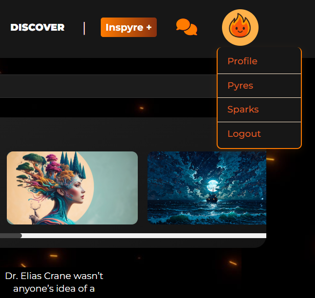

</details>

<br>

The Inspyre navbar provides persistent, intuitive navigation across the entire platform. It spans the full width of every page and remains fixed to the top of the viewport, ensuring constant access to key features - even while scrolling.

Key elements of the navbar include:

- The Inspyre logo, which doubles as a home button, following modern UX conventions by allowing users to quickly return to the homepage with a single click.

- A "Discover" button, also linking to the homepage, reinforcing its role as the central hub for browsing new content.

- The "Inspyre +" button, which opens the post creation menu, encouraging users to share new content from anywhere on the platform.

- An icon of two speech bubbles, which links directly to the direct messaging feature for quick access to conversations.

- A circular avatar image representing the logged-in user. Clicking or tapping this avatar reveals a dropdown menu with essential personal navigation options:

  - Profile – View or edit the user's own profile.

  - Pyres – Filter the homepage to show posts from followed creators.

  - Sparks – Filter the homepage to show liked posts.

  - Logout – End the session and return to the public view.

To help users stay oriented, the Discover, Inspyre +, and Messages buttons visually indicate the active route by switching from their default orange color to white when selected. This provides clear, subtle feedback about the user's current location within the platform.

### Homepage, Pyres & Sparks

#### Homepage & Browsing Experience

The Inspyre homepage was designed to place creative work front and center, with an emphasis on visual clarity, minimalism, and flow. On desktop, the layout adopts a gallery-style grid that maintains a consistent height for each post preview across a row, while allowing their widths to vary naturally. This creates an aesthetic that's both orderly and visually dynamic - encouraging exploration while avoiding monotony.

Each post preview is deliberately stripped back to its core content: a thumbnail for image posts or a truncated excerpt for text posts. There are no avatars, usernames, tags, like buttons, or comment threads on the desktop homepage. This intentional minimalism fosters a distraction-free browsing experience - clean, immersive, and focused entirely on the work itself. Hovering over a preview subtly enlarges it and reveals the post's title, offering a tactile, modern feel that rewards interaction without cluttering the view.

On mobile, the layout adapts to suit smaller screens with a more familiar vertical, feed-style format akin to platforms like Instagram or Facebook. Posts appear one after another in a scrollable column, each now also displaying the author's avatar and username (which link directly to the User's profile). This format is designed for easy engagement and intuitive navigation, making it feel instantly familiar to mobile-first users while maintaining the platform's visual identity.

Regardless of device, the homepage uses React's InfiniteScroll component to deliver a seamless browsing experience. Users can explore an unbroken feed of creative content, loading more posts effortlessly as they scroll - keeping inspiration flowing without interruption.

#### Pyres & Sparks Filters

<details>
<summary> Pyres </summary>

<br>


</details>

<br>

<details>
<summary> Sparks </summary>

<br>


</details>

<br>

To give users more control over their experience, the homepage includes two personalised filters: Pyres and Sparks, accessible via the dropdown menu in the navbar.

Pyres shows posts only from creators the user follows, effectively turning the homepage into a curated feed of trusted and favourite voices.

Sparks displays posts the user has liked - a personal trail of past inspiration, perfect for revisiting impactful work.

These filters reflect Inspyre's core theme: connection through creativity. Whether discovering new posts, revisiting saved work, or focusing on your creative circle, Pyres and Sparks ensure your feed remains meaningful and relevant.

### Post Searchbar

<details>
<summary> Searchbar </summary>

<br>


</details>

<br>

<details>
<summary> Searchbar - No Results </summary>

<br>


</details>

<br>

The post searchbar offers users a quick and intuitive way to discover content on Inspyre. It allows filtering by keywords found in a post's title or body, by a creator's username, or by relevant tags - making it easy to discover specific topics or creators of interest.

To ensure a smooth and responsive UX, the searchbar listens to every keystroke with a built-in 1-second debounce delay. This delay prevents excessive queries from being fired in rapid succession, striking a balance between real-time feedback and performance efficiency. The result is a search feature that feels fast and fluid, without overloading the system or interrupting the flow of browsing.

Much like the Pyres and Sparks features, searches simply filter the existing gallery to display only the returned results. Searches can also be combined with Pyres or Sparks, allowing users to refine their feed even further - for example, by searching only within posts they've liked, or content created by users they follow. This layered filtering system offers powerful, fine-grained control over how the gallery is populated, making discovery both flexible and personal.

### Detailed Post View

<details>
<summary> Post </summary>

<br>


</details>

<br>

When a user clicks on a post preview from the homepage, they're taken to the PostPage - a focused, fully-featured view where they can engage more deeply with the content and its creator. This page surfaces all relevant information about the post in a clean, readable format while supporting interaction and conversation.

From the PostPage, users can:

- View the creator's username and avatar, both of which link directly to the creator's profile.

- See the time and date the post was published.

- Read the full title of the post.

- View the main content, whether it's:

  - An image post, displayed at full size; or

  - A text post, rendered with proper formatting.

- If one has been written, read the description of an image post - ideal for context, backstory, or artist commentary.

- Take note of post tags, which may lead the user to discover similar creations via the post searchbar.

- Like the post using a responsive like button, with the total like count displayed alongside.

- See the comment count.

- Identify whether the creator has tagged the post as 'original'.

- Participate in conversation through the comment section, which displays all existing comments and allows new ones to be submitted.

- If the user is the owner of the post, they'll also see a dedicated edit/delete menu, allowing them to manage their content directly from this page.

The PostPage strikes a balance between presentation and interaction - celebrating the creative work while making it easy for users to show appreciation, start a dialogue, or explore related content.

### Comments

<details>
<summary> Comment Thread </summary>

<br>

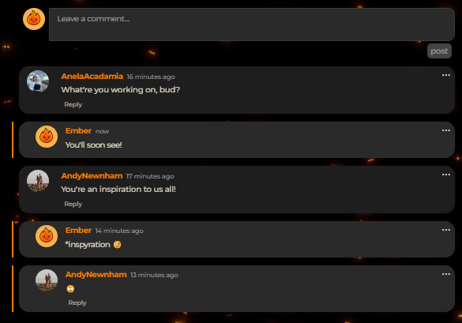

</details>

<br>

Inspyre supports a fully-featured commenting system designed to encourage meaningful engagement while maintaining a clean, modern interface. Comment sections are available on the detailed view of each post, where users can share feedback, ask questions, or start conversations around the content.

Key features of the comment system include:

- If a post has no comments, a friendly placeholder message is shown, confirming the space is open for new discussion.

- Users can comment directly on the post or reply to existing comments, supporting deeper conversation threads.

- Replies are visually nested beneath their parent comment, with subtle styling differences and a visible connecting line (or "thread") to clarify context.

- Each comment includes a 'vertical three-dot' dropdown menu, offering context-sensitive actions:

  - If the comment belongs to the current user, they'll see options to edit or delete the comment.

  - If it's another user's comment, a report option is displayed instead.

#### Editing & Reporting

<details>
<summary> Comment Editing </summary>

<br>


</details>

<br>

When editing a comment, the comment bubble is transformed into a textarea, allowing the user to make and save changes in real time without navigating away or refreshing the page.

For deletions, a confirmation modal appears to prevent accidental loss of content, ensuring good CRUD-based UX and giving users the opportunity to confirm or cancel the action.

<details>
<summary> Comment Reporting </summary>

<br>


</details>

<br>

<details>
<summary> Comment Moderating </summary>

<br>

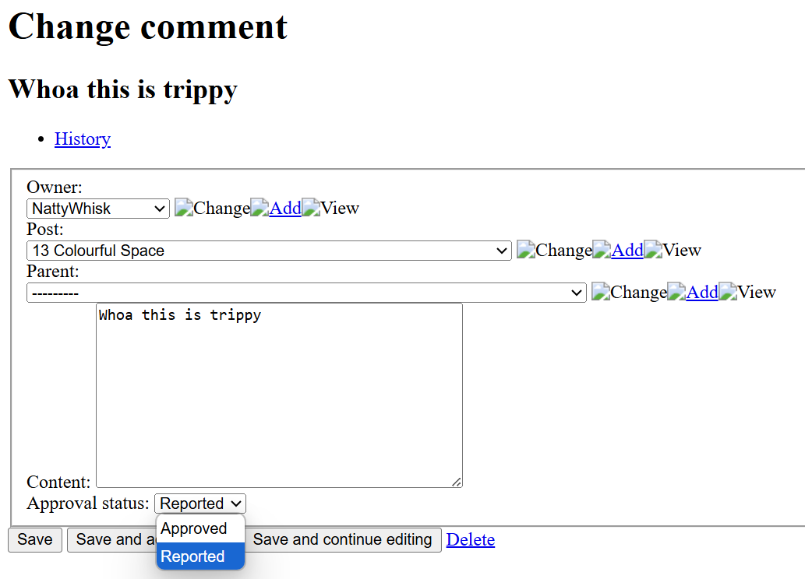

</details>

<br>

If a comment is reported (for inappropriate or offensive content), it is immediately hidden from public view, pending moderator review. In its place, a placeholder message appears noting that the comment has been reported.

All comments are accessible by moderators via the admin panel of the DRF API. Once reported, the "Approval status" of the comment is simply changed from its default status, "Approved", to its new status, "Reported". From here, the moderator can review the comment and decide whether it should be reinstated as "Approved", or deleted altogether.

This system strikes a balance between expressive discussion and responsible moderation, offering users a clear, intuitive way to engage with content while maintaining community standards.

### Likes & Trending Posts

<details>
<summary> 'Like' Button & Counter </summary>

<br>

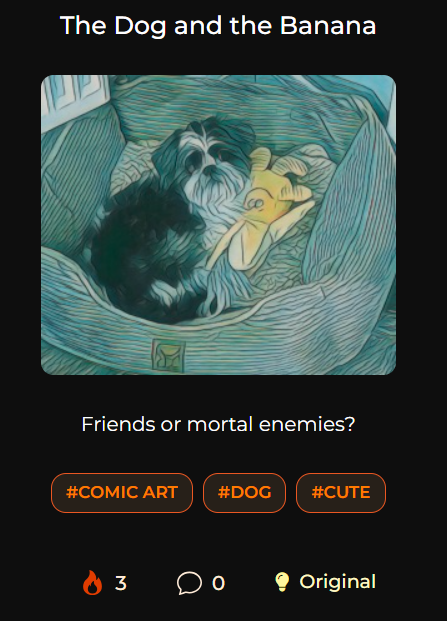

</details>

<br>

<details>
<summary> Trending Posts </summary>

<br>


</details>

<br>

Inspyre uses a simple, intuitive like system to let users show appreciation for posts. Rather than the traditional thumbs-up or heart icons, likes are represented with a flame icon, reinforcing the platform's core theme of creativity as fire. Each post displays its current like count, and users can toggle their like with a single click or tap.

The Trending Posts feature highlights the most popular content on the platform in real time. It tracks the total number of likes across all posts and displays the top 10 most liked posts within the “Trending Right Now” section at the top of the homepage. This gives users a quick snapshot of what's currently resonating with the community and helps elevate standout content for greater visibility.

### Post Creation

<details>
<summary> Post Creation Form </summary>

<br>


</details>

<br>

Inspyre empowers users to express themselves through both visual and written creations, with a post creation flow that intuitively guides users through the process.

When starting a new post, users are first presented with a creation type menu, prompting them to choose between crafting a visual post or a written post. This selection then funnels them to the appropriate creation form, tailored to their chosen medium.

#### Visual Posts

<details>
<summary> Visual Creation Form </summary>

<br>


</details>

<br>

- Users can upload an image file (with a size restriction of 2MB) to showcase artwork, photography, or any visual creation.

- Each image post includes fields for a title and an optional description, allowing creators to provide context, commentary, or narrative behind the visual.

#### Written Posts

<details>
<summary> Written Creation Form </summary>

<br>

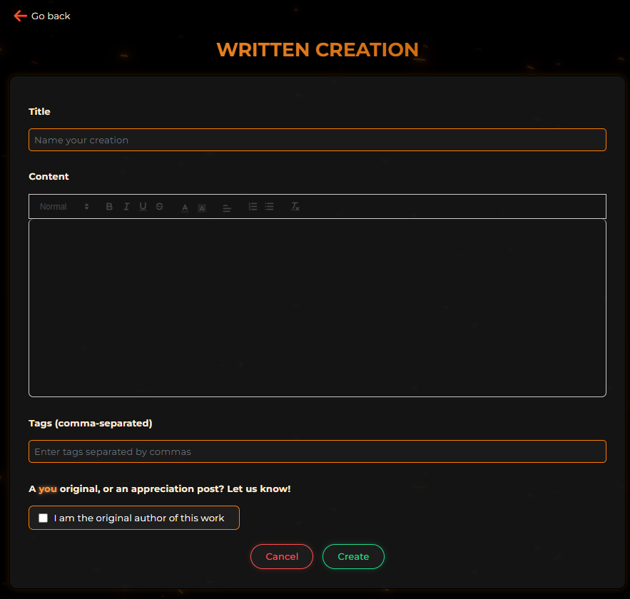

</details>

<br>

<details>
<summary> React Quill Editor </summary>

<br>

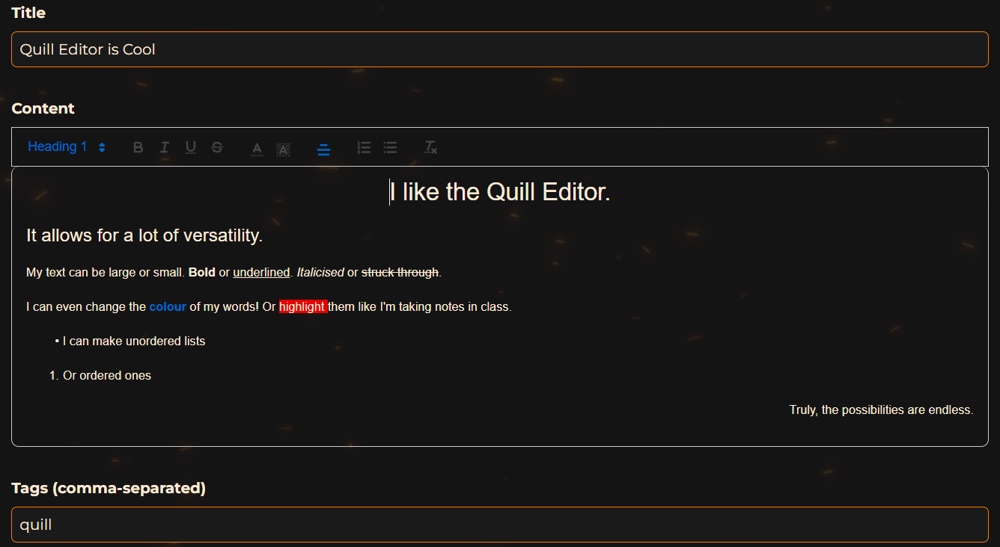

</details>

<br>

<details>
<summary> React Quill Demo Post </summary>

<br>


</details>

<br>

- Text-based posts can be pasted into the editoror or composed from scratch using the integrated React Quill rich text editor.

- The editor supports basic formatting options like bold, italics, alignment, headers, and color - enabling creators to craft expressive written pieces that feel polished and personal.

#### Tags & Attribution

- All posts - visual or written - can include custom tags, which provide thematic or descriptive context. These tags are searchable via the homepage searchbar, making them a valuable tool for discovery and categorization.

- Creators also have the option to mark their post as “Original.” When selected, this tag communicates to other users that the content is the creator's own work. If the user is sharing or reposting someone else's work, they can leave this option unchecked - a simple yet meaningful way to promote honesty and transparency around attribution.

The post creation system is built to be quick, expressive, and respectful of creative ownership - ensuring that users can share confidently and authentically.

### Post Editing & Deleting

Inspyre gives creators full control over their content even after it's been published. From the detailed post view, users who own the post can access the edit/delete menu, allowing them to manage their work with ease.

#### Editing Posts

<details>
<summary> Edit Post Form </summary>

<br>


</details>

<br>

- When selecting 'edit', the user is taken to an editing form that is pre-filled with the original post content.

- The editing interface mirrors the original creation form - whether it's the image upload fields or the React Quill editor - ensuring a consistent and intuitive experience.

- Users can update the post's title, content, tags, and description, or toggle the 'Original' status as needed.

- Upon saving, changes are immediately reflected in the post view without requiring a page refresh.

#### Deleting Posts

- Selecting 'delete' triggers a confirmation modal, preventing accidental deletions.

- If confirmed, the post is permanently removed from the platform and will no longer appear in the homepage feed, search results, or user profile.

This streamlined approach ensures that users can revise, refine, or remove their work as they see fit, maintaining creative ownership and control throughout the lifecycle of each post.

### Profile Page

<details>
<summary> Profile Page </summary>

<br>

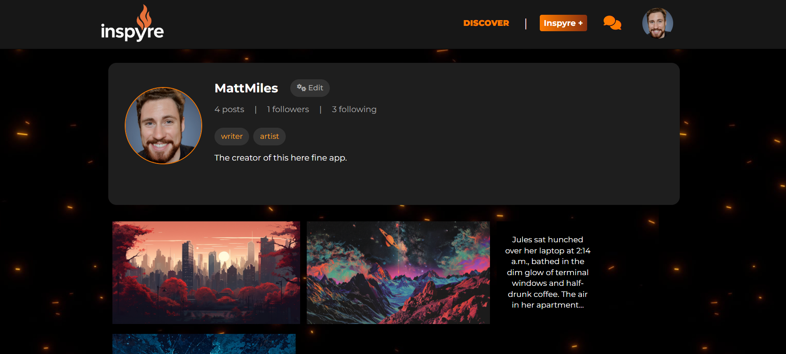

</details>

<br>

<details>
<summary> Profile Page (Other User) </summary>

<br>

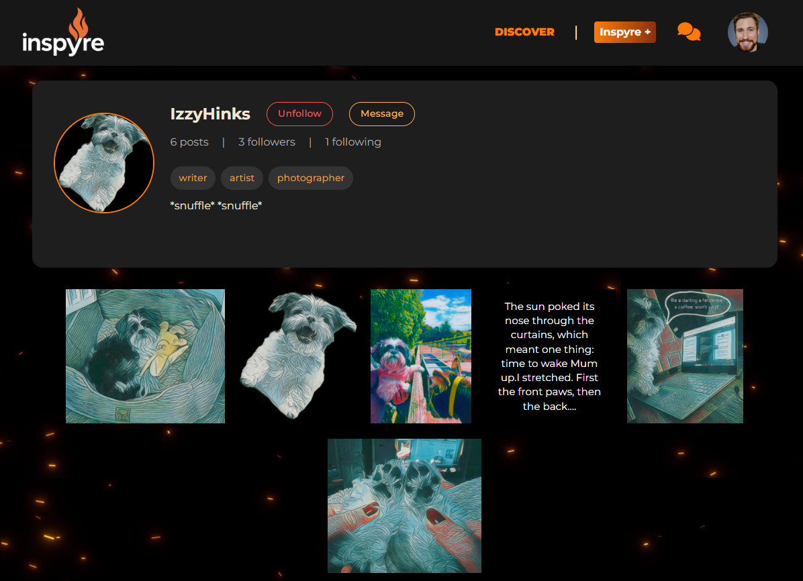

</details>

<br>

The Profile Page is each user's personal hub on Inspyre - a curated space that showcases their identity, creative work, and social presence. Whether viewing your own profile or someone else's, the layout is designed to be clean, accessible, and focused on content.

#### Viewing a Profile (Your Own or Another's)

From any profile page, users can:

- View the profile owner's display name, bio, and profile picture.

- Browse a gallery of published posts, laid out in a familiar scrollable grid.

- See a count of followers and following, both of which are clickable to view lists of the respective users.

- View the profile owner's selected tags, giving insight into the mediums they use to create.

- Choose to follow or unfollow the profile owner (unless it's their own profile), via the 'un/follow' button.

- Create a new - or open an existing - chat with the profile owner, via the 'message' button.

<details>
<summary> Profile - No Posts </summary>

<br>

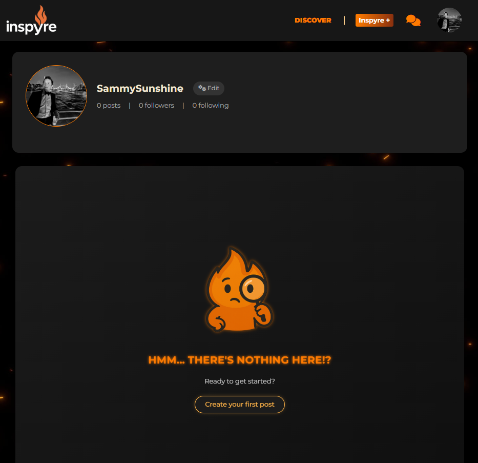

</details>

<br>

Should a user not have any posts to display on their profile, their gallery will instead be populated with the 'no results' image of Ember, along with a conditional message that changes if the user is the profile owner. Given the latter, there will also be a button with the message, "Create your first post". This button works functionally identically to the "inspyre +" button in the navbar, but offers the user that extra encouragement to begin their creative journey.

#### Editing Your Profile

<details>
<summary> Profile Editing - Details </summary>

<br>


</details>

<br>

<details>
<summary> Profile Editing - Username </summary>

<br>


</details>

<br>

<details>
<summary> Profile Editing - Password </summary>

<br>


</details>

<br>

When viewing your own profile, you’ll have access to an Edit Profile button, which allows you to update:

- Your display name and bio.

- Your profile picture.

- Your profile tags, chosen from a curated list, used to personalize your profile and communicate your preferred means of creating to other users.

The profile editing experience is designed to be fast and easy, ensuring users can maintain an identity that evolves alongside their creative journey.

### Following System

<details>
<summary> Follow Button </summary>

<br>


</details>

<br>

<details>
<summary> Unfollow Button </summary>

<br>


</details>

<br>

<details>
<summary> Following Modal </summary>

<br>


</details>

<br>

Inspyre includes a modern, conventional following system to help users build creative circles and stay connected with the work they care about most.

#### Following a User

- From any profile page, users can follow or unfollow creators with a single click. Like many other features within Inspyre, following and unfollowing a profile is done without need to refresh the page, thereby causing no interruption to the UX.

- When you follow someone, their posts will now appear in your Pyres feed - a personalized view of content from creators you trust and admire.

- 'Follower' and 'following' counts are visible on every profile and are clickable, opening a full list of users in each category.

#### Social Discovery

- Following helps drive discovery and engagement by surfacing new work from familiar creators.

- It also allows users to build networks organically, based on shared interests, styles, or themes - all without the noise of unnecessary notifications or algorithms.

- Amassing a following and having other users positively interact with your creations can also act as a great motivator to create more. This establishes a self-perpetuating life cycle for the platform, keeping users engaged as creators and consumers.

This system reinforces Inspyre’s ethos of creative connection: you follow the people who inspire you, and your 'Pyres' feed becomes a reflection of that inspiration.

### Direct Messaging

<details>
<summary> Chat List </summary>

<br>


</details>

<br>

<details>
<summary> Chat Page </summary>

<br>

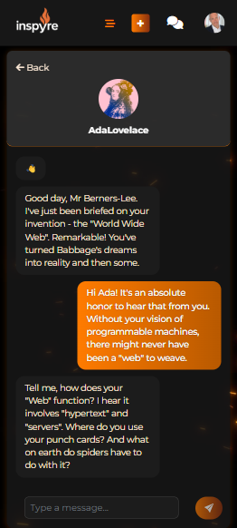

</details>

<br>

<details>
<summary> Chat Searchbar </summary>

<br>


</details>

<br>

To support deeper connection and collaboration, Inspyre includes a built-in Direct Messaging feature. This system allows users to communicate in a one-on-one format - whether to exchange feedback, ask questions, or simply connect beyond public comments.

#### Key Features:

- Accessible via the speech bubbles icon in the navbar, which leads to a dedicated messaging interface.

- Users can view existing conversations or start a new conversation by searching for a profile in the searchbar. Alternatively, new conversations can be created directly from another user's profile page (as discussed above)

- When starting a new conversation, a friednly 'wave' emoji is automatically sent to break the ice and get the conversation flowing.

- Messages appear in a clean, chat-style format, designed to emulate other popular messaging apps such as WhatsApp and Facebook Messenger. This gives the direct messaging feature a modern and polished feel.

Direct Messaging is designed to complement the broader community experience - fostering genuine interaction without disrupting the visual and creative flow of the platform.

#### Limitations & Technical Notes

While platforms like Firebase or TalkJS offer plug-and-play messaging solutions with real-time syncing, this project was intentionally built to showcase custom feature development and problem-solving. As a result, I chose to implement the messaging system from scratch, using Django and React, rather than relying on third-party libraries.

Due to this constraint, the messaging system currently lacks true real-time communication. Messages you send appear instantly, but incoming messages require a page refresh to be retrieved. This limitation stems from the absence of WebSocket or long-polling functionality, which I intentionally deferred to keep the focus on core logic and user interface development.

This design decision reflects the balance between technical depth and project scope - and is something I expand on in the Future Features section below.

### Custom Modal

<details>
<summary> Deletion Modal </summary>

<br>

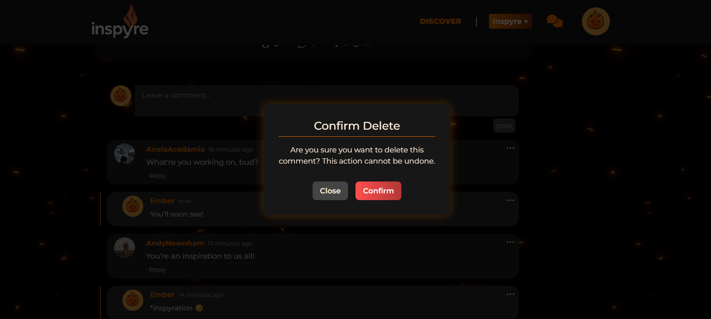

</details>

<br>

<details>
<summary> Confirmation Modal </summary>

<br>

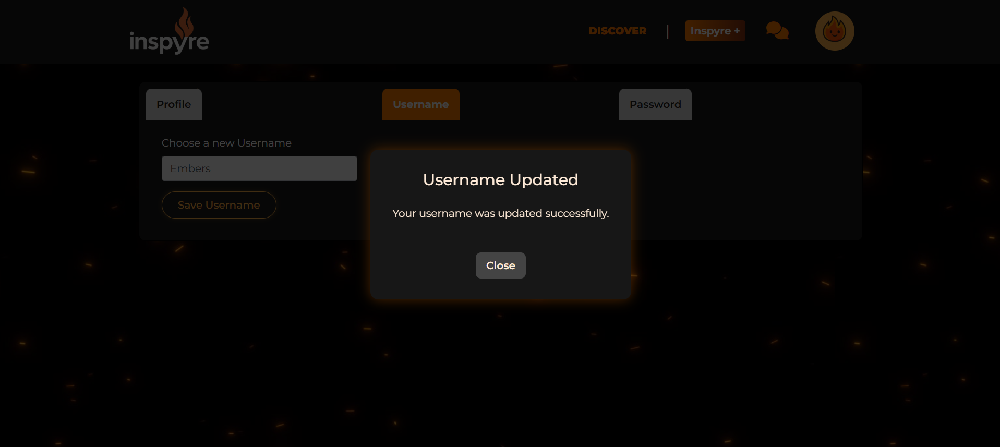

</details>

<br>

While Bootstrap provides a convenient prebuilt modal system, I found its default styling too rigid and difficult to override cleanly with custom CSS. To gain more control over the user experience and visual consistency, I opted to develop a custom Modal component from scratch.

This bespoke modal is fully reusable across the platform, making it easy to trigger dialogue boxes wherever needed, with consistent styling and behavior that aligns with Inspyre’s design language.

Key Use Cases:

- Action confirmation for potentially destructive operations, such as deleting a post or reporting a comment. This adds an extra layer of safety and prevents accidental changes.

- User feedback for subtle changes that may not provide instant visual cues — for example, updating a username or password, or confirming account creation.

- Smooth integration into various flows without relying on external libraries.

By building this modal component myself, I was able to tailor both its appearance and functionality to the needs of the platform — and maintain flexibility as new features are added.

### Custom Dropdown Menu

<details>
<summary> Dropdown Menu - User Comment </summary>

<br>


</details>

<br>

Similar to my custom modal, I also decided to build a custom dropdown menu component instead of using Bootstrap's native dropdowns. While Bootstrap's components offer functionality out-of-the-box, I found them too restrictive to style cleanly, and wanted to maintain full control over the menu's style and behaviour.

This custom dropdown is a modular, reusable menu that supports dynamic action rendering — it adapts its available options (e.g., Edit, Delete, Report) based on the props passed to it. This makes it suitable for multiple contexts across the platform, including post menus and comment threads. It also dynamically calculates its position and renders to a dedicated DOM node for better control over layering and z-indexing.

### Custom Error Pages

<details>
<summary> 401 Error </summary>

<br>


</details>

<br>

<details>
<summary> 403 Error </summary>

<br>

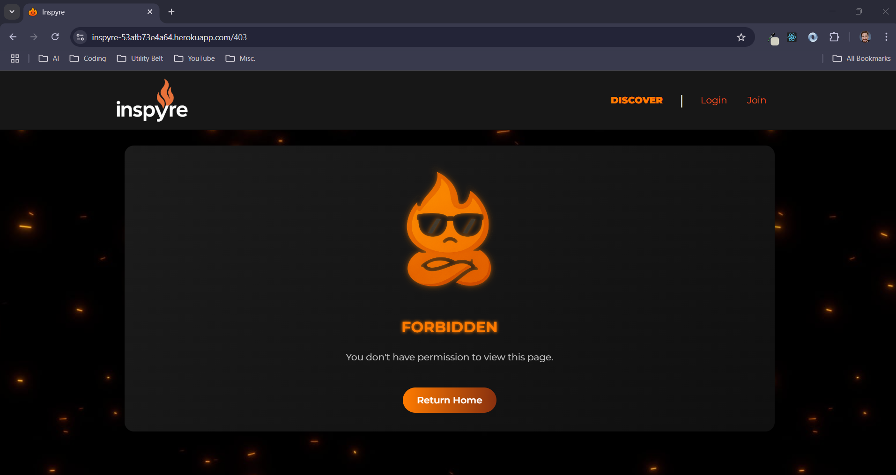

</details>

<br>

<details>
<summary> 404 Error </summary>

<br>

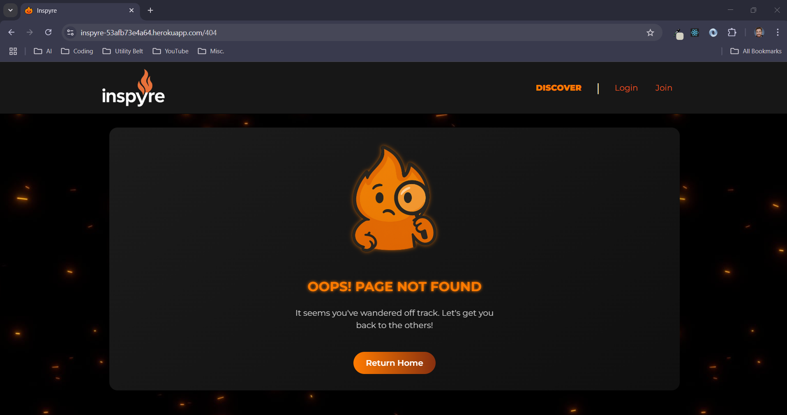

</details>

<br>

<details>
<summary> 500 Error </summary>

<br>


</details>

<br>

<details>
<summary> 503 Error </summary>

<br>

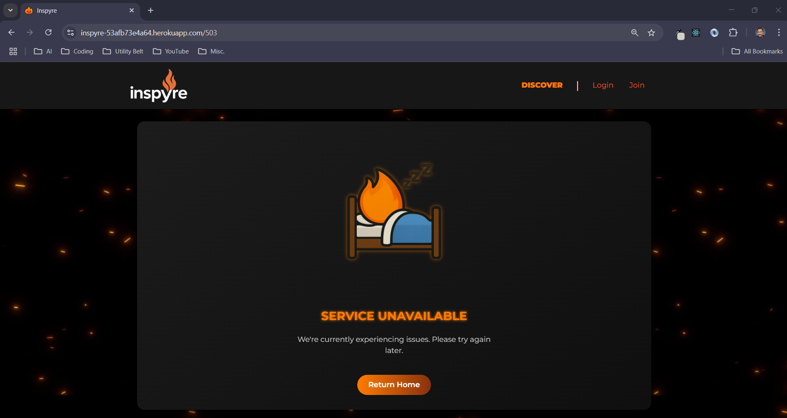

</details>

<br>

To maintain a seamless and immersive user experience, Inspyre includes custom-designed error pages for common HTTP status codes, including 401 (Unauthorized), 403 (Forbidden), 404 (Not Found), 500 (Internal Server Error), and 503 (Service Unavailable).

Rather than relying on browser defaults or abrupt server messages, each custom page is styled to match the overall look and feel of the platform. These pages provide clear, friendly messaging and include a call-to-action button that directs the user safely back to the homepage.

This approach helps ensure that even when something goes wrong, the UX remains polished and consistent with Inspyre’s theme and tone — keeping users engaged instead of frustrated.

## Future Features

As Inspyre continues to evolve, there are several planned features aimed at improving functionality, enhancing user safety, and expanding the creative and social potential of the platform:

### Notifications

A real-time notification system to alert users of new likes, comments, follows, and messages — keeping them engaged and informed without needing to refresh or check manually.

### Email Integration

Linking user accounts to verified email addresses will allow for secure account recovery, email-based notifications, and better user identity management.

### Comment Likes

The ability to like individual comments — a small but meaningful way to encourage thoughtful discussion and highlight valuable contributions.

### Image File Compression

Built-in file compression for image uploads to improve performance, reduce bandwidth usage, and streamline the upload process without compromising visual quality.

### Post Drafts

Support for saving draft posts — allowing users to start a visual or written piece and return to finish it later without losing their progress.

### Expanded Reporting System

Enhancing the current reporting flow to include posts and user profiles, not just comments. Reported content will be flagged for moderator review rather than hidden immediately, helping prevent abuse and aligning with modern moderation practices.

### Global Searchbar

A powerful searchbar integrated into the navbar that allows users to search across profiles, profile tags, posts, and post tags. Unlike the current filtering system, this will return a dedicated results page, improving discovery across the entire platform.

### Messaging System Upgrade

Replacing the current custom-built messaging system with a plug-and-play solution such as Firebase or TalkJS to enable:

- True instant messaging

- End-to-end encryption

- Multi-device/cloud sync

- Group conversations

- Media attachments

- Message deletion/editing

This will elevate Inspyre’s messaging experience to match modern standards.

### Blocking Users

A block system to allow users to protect themselves from unwanted interaction. Blocked users will be unable to view your profile, posts, comments, or message you, ensuring personal boundaries are respected. Likewise, if you block a user, they will become entirely hidden from your experience of the platform.

### Private Profiles

Support for private account modes. These profiles will remain searchable and visible, but their content will only be accessible to approved followers. Follow requests will require approval, and the entire profile interaction system will adjust to accommodate this added layer of control and privacy.

### User Account Deletion (Temporarily Removed)

Inspyre originally included a fully functional user account deletion feature, allowing users to permanently remove their profile and associated content. However, during development, I encountered a persistent bug related to the CurrentUserContext, ProfileDataContext, and axios interceptors — as implemented in Code Institute’s advanced frontend walkthrough project, Moments.

Specifically, after deleting an account, the application would enter a 401 Unauthorized error loop, repeatedly attempting to authenticate the now-deleted user until the refresh token expired. This issue disrupted the user experience and could not be reliably resolved within the current framework.

Despite significant effort — including extensive independent debugging, collaboration with student support, and guidance from my mentor — the underlying issue remained unresolved. On their advice, I made the decision to temporarily remove the feature to maintain platform stability.

However, I have preserved the original handleDelete logic within the project codebase, and fully intend to re-implement account deletion in the future, once the context/interceptor bug is addressed or a more robust session management strategy is in place.

## Testing

For manual testing, lighthouse reports and validator results, please head to [testing.md](./README/testing/testing.md).

## Project Management - an Agile Approach

### Agile Methodology

I used the Agile methodology to plan my project in terms of iterations. Tasks were created as segmented 'User Stories', each with their own acceptance criteria. These User Stories were prioritised using the MoSCoW method (see below) and worked through incrementally, allowing for an objective driven yet adaptable development process. User Stories were also categorised into separate Milestones (i.e., 'Direct Messaging'), to make it easier to track how far progressed I was with each feature group. Features I knew I wanted but wouldn't feasibly achieve by the project deadline were labelled as 'not required in this iteration'.

### MoSCoW Prioritisation

In order to prioritise my User Stories, I used MoSCoW Prioritisation to label each issue one of the following:

- Must Have - product requires this feature to be viable.

- Should Have - feature would add substantial value to product

- Could Have - feature could add value to the product.

- Won't Have - feature isn't required during this iteration (non-priority)

### GitHub Project - Kanban Board

I used GitHub Issues and Projects to manage the above-mentioned process. Each issue provided a User Story, which was placed on a Kanban board in my Inspyre Project. This board was separated into 4 columns: 'To Do', 'In Progress', 'Done' and 'Not Required This Iteration'. I linked both my frontend and backend repos to this project, which can be viewed [here](https://github.com/users/MattMiles95/projects/8/views/1)

## Technologies Used

### Languages

- [HTML 5](https://en.wikipedia.org/wiki/HTML5)

- [CSS 3](https://en.wikipedia.org/wiki/CSS#CSS_3)

- [Python](<https://en.wikipedia.org/wiki/Python_(programming_language)>)

- [JavaScript](https://en.wikipedia.org/wiki/JavaScript)

### Frameworks, Libraries & Programs Used

#### Frameworks

- [Bootstrap ^4.6.0](https://getbootstrap.com/docs/4.6/getting-started/introduction/) - Open-source CSS framework.
- [Django 4.2.20](https://www.djangoproject.com/) - Open-source Python framework.
- [Django Rest Framework 3.15.2](https://www.django-rest-framework.org/) - Open-source Python framework, specifically for building Web APIs.
- [dj-rest-auth](https://dj-rest-auth.readthedocs.io/en/latest/) - Authentication library for Django REST framework.
- [django-allauth](https://django-allauth.readthedocs.io/en/latest/) - Authentication system for Django.
- [django-cloudinary-storage](https://github.com/klis87/django-cloudinary-storage) - Cloudinary integration for Django’s file storage.
- [django-cors-headers](https://pypi.org/project/django-cors-headers/) - Django app for handling CORS headers.
- [django-filter](https://django-filter.readthedocs.io/en/stable/) - Filtering library for Django REST Framework.
- [djangorestframework-simplejwt](https://django-rest-framework-simplejwt.readthedocs.io/en/latest/) - JWT authentication for Django REST Framework.
- [React ^19.0.0](https://react.dev/) - Open-source JavaScript library.

#### Libraries

- [asgiref](https://docs.djangoproject.com/en/stable/releases/3.0/#asgiref) - ASGI interface reference implementation used in Django.
- [cffi](https://cffi.readthedocs.io/en/latest/) - Foreign Function Interface for calling C code from Python.
- [charset-normalizer](https://github.com/Ousret/charset_normalizer) - Encoding detection library for Python.
- [cloudinary (Python SDK)](https://cloudinary.com/documentation/django_integration) - Media management SDK.
- [cryptography](https://cryptography.io/en/latest/) - Python library for cryptographic operations.
- [idna](https://pypi.org/project/idna/) - Internationalized domain names support.
- [oauthlib](https://oauthlib.readthedocs.io/en/latest/) - OAuth1 and OAuth2 support for Python.
- [packaging](https://packaging.pypa.io/en/latest/) - Core utilities for Python package versioning.
- [pillow](https://python-pillow.org/) - Python Imaging Library fork for image processing.
- [psycopg2 2.9.10](https://www.psycopg.org/) - PostgreSQL database adapter for Python.
- [PyJWT](https://pyjwt.readthedocs.io/en/stable/) - JSON Web Token library for Python.
- [python3-openid](https://github.com/necaris/python3-openid) - OpenID authentication support for Python 3.
- [pytz](https://pypi.org/project/pytz/) - World timezone definitions for Python.
- [requests](https://docs.python-requests.org/en/latest/) - Python HTTP library.
- [requests-oauthlib](https://requests-oauthlib.readthedocs.io/en/latest/) - OAuth support for the Python requests library.
- [setuptools](https://setuptools.pypa.io/en/latest/) - Python package installation and dependency tool.
- [six](https://six.readthedocs.io/) - Python 2 and 3 compatibility utilities.
- [sqlparse](https://sqlparse.readthedocs.io/en/latest/) - SQL parser and formatter for Python.
- [tzdata](https://pypi.org/project/tzdata/) - IANA timezone data for Python.
- [urllib3](https://urllib3.readthedocs.io/en/latest/) - HTTP client for Python.
- [webencodings](https://github.com/SimonSapin/python-webencodings) - Character encoding APIs used by HTML5.

#### Programs

- [gunicorn](https://gunicorn.org/) - WSGI HTTP server for Python web apps.
- [whitenoise](https://whitenoise.readthedocs.io/en/latest/) - Static file serving for Python web apps.

#### Tools & Utilities

- [Balsamiq](https://balsamiq.com/) - Wireframing app.
- [Chrome DevTools](https://developer.chrome.com/docs/devtools) - Browser developer tools for testing and auditing code.
- [Chrome Eye Dropper](https://chromewebstore.google.com/detail/eye-dropper/hmdcmlfkchdmnmnmheododdhjedfccka) - Browser extension for colour sampling.
- [Cloudinary](https://cloudinary.com/home) - Cloud-based file storage service.
- [Font Awesome](https://fontawesome.com/) - CSS font and icon toolkit.
- [Git](https://git-scm.com/) - Version control system.
- [GitHub](https://github.com/) - Online repository storage and Agile project management tools.
- [Google Fonts](https://fonts.google.com/) - Open-source font library.
- [Heroku](https://www.heroku.com/home) - Site for app deployment.
- [Lucid](https://lucid.app/documents#/documents?folder_id=home) - Logic diagram design app.
- [Photopea](https://www.photopea.com/) - Photo editing software.
- [PostgreSQL](https://www.postgresql.org/) - Open-source object-relational database system.
- [Visual Studio Code](https://code.visualstudio.com/) - IDE.

## Local Development & Deployment

This app was developed using VSCode and both the frontend and backend repos were deployed via Heroku.

Prior to the below deployment process, enter the `pip freeze > requirements.txt` command in your Git Bash terminal inside the backend project folder to update your requirements.txt file. Once this has been done, you can deploy both the backend and frontend via Heroku using the following steps:

### Backend Deployment (API)

1. Login to [Heroku](https://dashboard.heroku.com/).

2. On the 'Dashboard', click **"New"** then **"Create new app"**.

3. Choose a unique app name for the backend (e.g., `inspyre-api`) and select your region.

4. Click **"Create app"**.

5. Under the **Settings** tab, locate **"Config Vars"**.

6. Click **"Reveal Config Vars"** and add the following variables:

- ALLOWED_HOSTS

- CLIENT_ORIGIN

- CLIENT_ORIGIN_DEV

- CLOUDINARY_URL (if required)

- DATABASE_URL

- SECRET_KEY

7. Under the **Deploy** tab:

- Select **GitHub** as the deployment method.
- Search for your backend repo and click **"Connect"**.
- Choose either **"Enable Automatic Deploys"** or **"Manual Deploy"**.
- Deploy the main branch.

8. Wait for the build and publish process. Once completed, test your API via the Heroku app link to ensure successful deployment.

### Frontend Deployment

1. Return to the [Heroku Dashboard](https://dashboard.heroku.com/) and click **"New" > "Create new app"** again.

2. Choose a unique app name for the frontend (e.g., `inspyre`) and select your region.

3. Click **"Create app"**.

4. Under the **Deploy** tab:

- Select **GitHub** as the deployment method.
- Search for your **frontend repository** and click **"Connect"**.
- Choose either **"Enable Automatic Deploys"** or **"Manual Deploy"**.
- Deploy the main branch.

5. Wait for the build to complete. When finished, visit the frontend app link to verify everything is working and that it connects to your backend correctly.

Once both are deployed, test the full integration from your frontend UI, checking authentication, media upload (via Cloudinary), and any protected routes or API endpoints. Ensure that your deployed backend app is set as the base url within your frontend app's **"axiosDefaults"** file.

### Forking the GitHub Repository

Forking the repository creates a copy of the original, allowing us to view and change the repository without affecting the original. This can be done by following the below steps:

1. Open the GitHub repository - [PP5_Inspyre_Frontend](https://github.com/MattMiles95/PP5_Inspyre_Frontend) / [PP5_Inspyre_Backend](https://github.com/MattMiles95/PP5_Inspyre_Backend).

2. Select the "Fork" button in the top-right section of the page.

A copy of the repository should now be in your own GitHub account.

### Local Clone

Cloning the repository allows you to copy the files into your own IDE for local development. This can be done by following the below steps:

1. Open the GitHub repository - [PP5_Inspyre_Frontend](https://github.com/MattMiles95/PP5_Inspyre_Frontend) / [PP5_Inspyre_Backend](https://github.com/MattMiles95/PP5_Inspyre_Backend).

2. Navigate the 'Code' dropdown menu and select whether you wish to clone the code using HTTPS, SSH or GitHub CLI.

3. Open the a Git Bash terminal in your chosen IDE and navigate your working directory to the location you wish to clone the project.

4. Use the command 'git clone' followed by the link you copied from the repository.

### Code Institute PostgreSQL Database

1. Create a Code Institute PostgreSQL account.

2. Create a new instance.

3. Copy the database URL.

4. Add database to the **env.py** file in your IDE.

5. Add the database to your Heroku app's **Config Vars**.

### Cloudinary

1. Create an account with [Cloudinary](https://cloudinary.com/).

2. Add your Cloudinary API environment variable to your **env.py** and Heroku app's **Config Vars**.

3. In settings.py, add Cloudinary libraries to INSTALLED_APPS in the following order:

```
   'cloudinary_storage',
   'django.contrib.staticfiles',
   'cloudinary',
```

4. Also in settings.py, configure Cloudinary to provide secure responses over HTTPS instead of HTTP:

```
cloudinary.config(
    secure=True
)
```

## Credits

### Affiliations

Inspyre is a fictional brand I created for this project. I hold no copyright for the brand and am not affiliated with any persons, organisations or platforms.

### Copy (Written Material)

Due to the nature of the project, I required a large sample of visual content to use as posts & profile pics. Most of these images were obtained from open source image websites. Those that weren't were either created by me, taken from friends' social media accounts (with their permission), or generated via AI (all instances of the mascot, Ember, were generated via ChatGPT's image generation feature). All text posts were written by me, save for "On the Boundless Machinery of Imagination", "Reclaiming the Web: A Reflection by Tim Berners-Lee" and "'Quiet Luxury': The Rise of Understated Elegance in Fashion", which were generated using ChatGPT.

### Code Credits

Both my frontend and backend projects were built using my Code Institute "Moments" walkthrough project as a foundation. Inspyre has evolved substantially from this foundation, but much of the core logic and naming conventions of that project persist within the bones of my final code. All other code featured in this project has been written by me, with the assistance of the Slack community, various forums, articles, YouTube videos, a great deal of coffee and the help from my mentor, Mitko Bachvarov.
