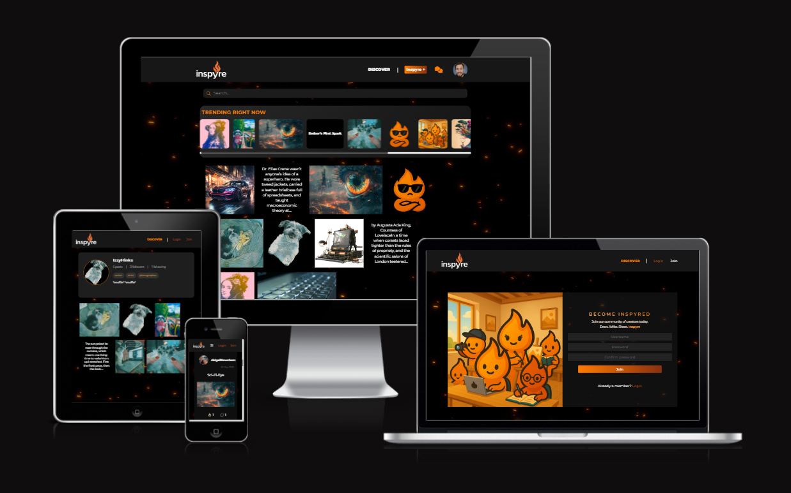
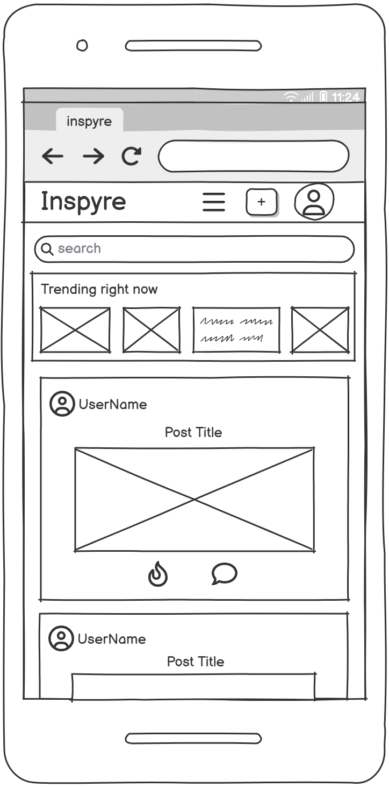
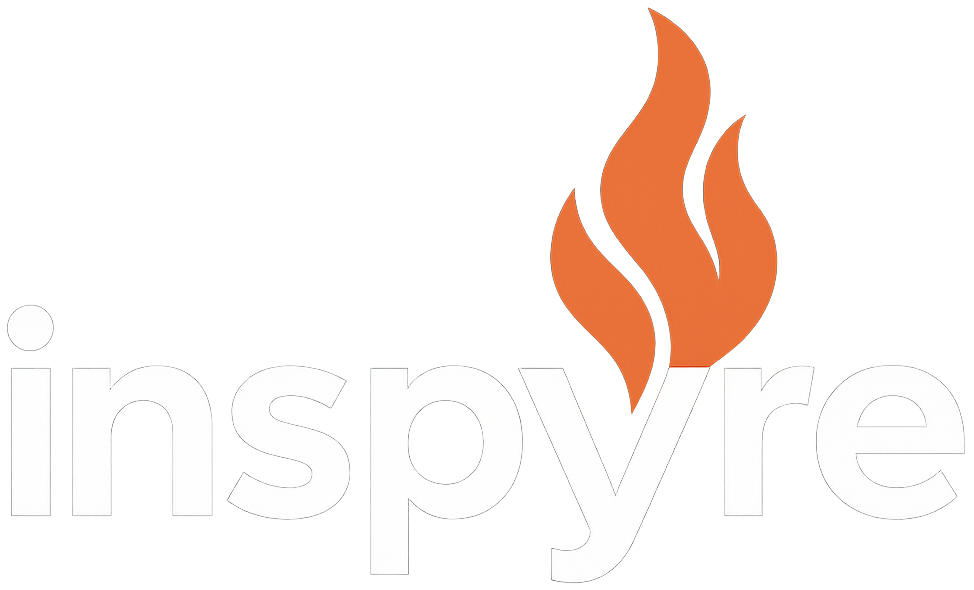
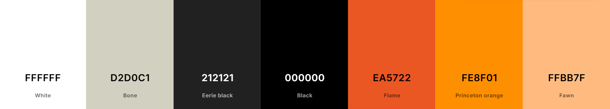
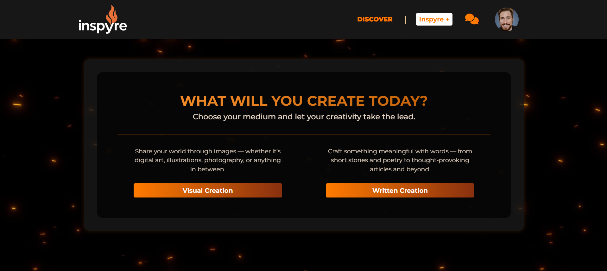
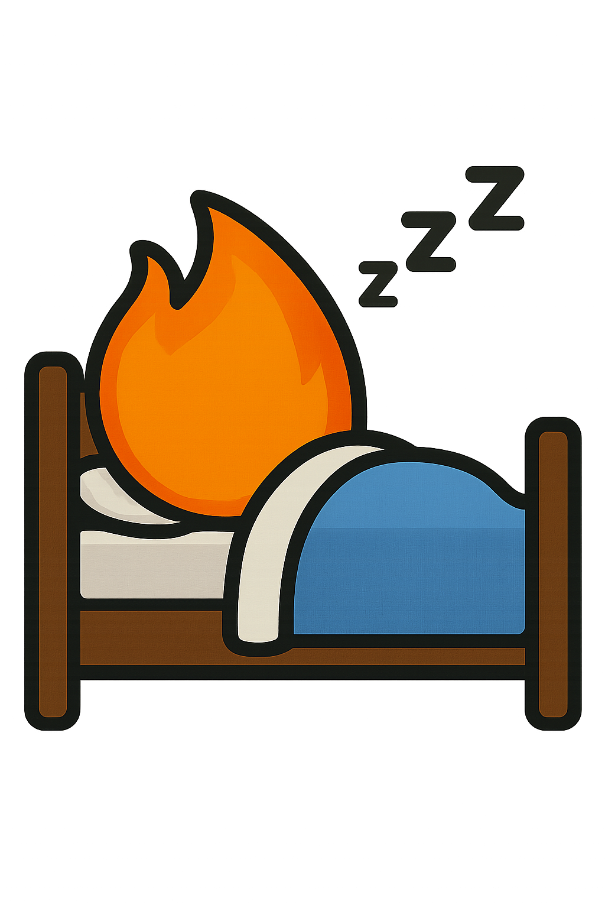
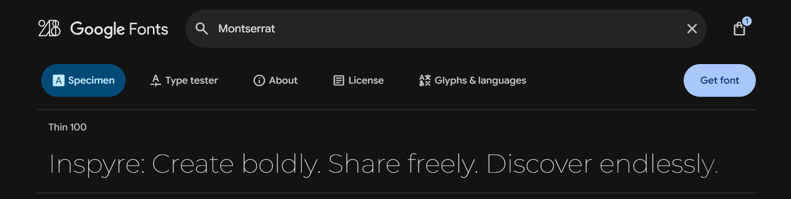
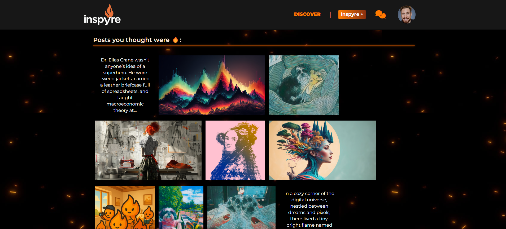
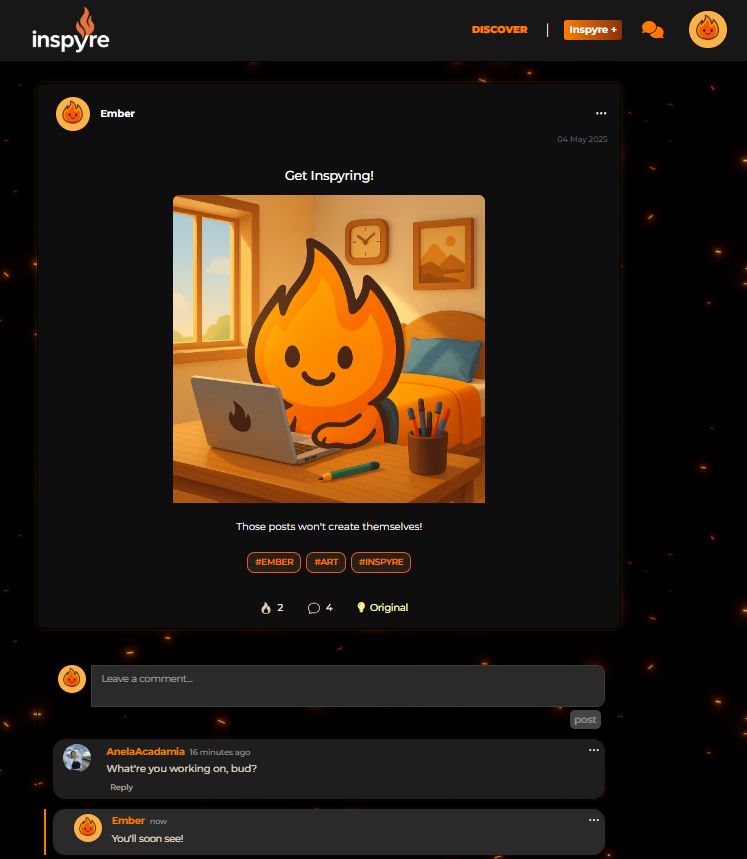

# Inspyre

### Create boldly. Share freely. Discover endlessly.

#### Frontend React app - for the backend DRF API, [click here](https://github.com/MattMiles95/PP5_Inspyre_Backend).

Inspyre is a modern content-sharing platform designed to empower creativity and connection. Whether you're a digital artist, writer, photographer, or passionate hobbyist, Inspyre gives you the tools to showcase your work, engage with a like-minded community, and discover new inspiration every day.

Built with a clean, responsive UI and a focus on discoverability, Inspyre supports both image-based and text-based posts, user profiles with customizable tags, an intuitive editing experience and a built in direct messaging service. It's a place to be seen, to be heard, and to inspire—and be inspired.

[Visit the deployed site](https://inspyre-53afb73e4a64.herokuapp.com/)

## Table of Contents

### [User Experience (UX)](#user-experience-ux-1)

- [User Stories](#user-stories)

### [Logic](#logic-1)

### [Design](#design-1)

- [Wireframes](#wireframes)
- [Theme](#theme)
- [Colours](#colours)
- [Brand: Meet Ember](#brand-meet-ember)
- [Favicon](#favicon)
- [Typography](#typography)
- [Accessibility](#accessibility)
- [Responsiveness](#responsiveness)

### [Features](#features-1)

- [Authorisation](#authorisation)
- [Homepage, Pyres & Sparks](#homepage-pyres--sparks)
- [Post Searchbar](#post-searchbar)
- [Detailed Post View](#detailed-post-view)
- [Comments, Replies & Threads](#comments-replies--threads)
- [Likes & Trending Posts](#likes--trending-posts)
- [Post Creation](#post-creation)
- [Post Edit & Deletion](#post-edit--deletion)
- [Profile Page](#profile-page)
- [Direct Messaging](#direct-messaging)
- [Custom Modal](#custom-modal)
- [Custom Dropdown Menu](#custom-dropdown-menu)
- [Custom Error Pages](#custom-error-pages)

### [Future Features](#future-features-1)

- [Reporting Posts](#reporting-posts)
- [Global Searchbar](#global-searchbar)
- [User Account Deletion](#user-account-deletion)
- [Deleting Individual Messages](#deleting-individual-messages)
- [Group Conversations](#group-conversations)
- [Multi-Media Message Capability](#multi---media-message-capability)
- [Blocking Users](#blocking-users)
- [Private Profiles](#private-profiles)

### [Project Management - an Agile Approach](#project-management---an-agile-approach-1)

- [Agile Methodology](#agile-methodology)
- [MoSCoW Prioritisation](#moscow-prioritisation)
- [GitHub Project - Kanban Board](#github-project---kanban-board)

### [Technologies Used](#technologies-used-1)

- [Languages](#languages)
- [Frameworks, Libraries & Programs Used](#frameworks-libraries--programs-used-1)

### [Testing](#testing-1)

### [Local Development & Deployment](#local-development--deployment-1)

- [Forking the GitHub Repository](#forking-the-github-repository)
- [Local Clone](#local-clone)
- [Code Institute PostgreSQL Database](#code-institute-postgresql-database)
- [Cloudinary](#cloudinary)

### [Credits](#credits-1)

- [Affiliations](#affiliations)
- [Copy (Written Material)](#copy-written-material)
- [Code Credits](#code-credits)

## User Experience (UX)

Inspyre is designed to feel like a creative home — a platform where users don’t just consume content, but actively participate in an ongoing exchange of ideas and inspiration.

_Effortless Discovery:_ From the moment users land on the homepage, they’re greeted with a dynamic gallery of visual and written content, curated for exploration. Browsing is fast, intuitive, and immersive — with minimal clutter and maximum focus on the work.

_Creative Expression:_ Users can easily create and share posts, whether it’s artwork, photography, short stories, or thought pieces. Image-based and text-based content types are both first-class citizens, each with tailored editing interfaces.

_Personalized Profiles:_ Each user gets a customizable profile with a bio, profile tags to highlight your creative mediums, a profile photo, and a clean portfolio-style layout. Their posts, followers, and following lists are all easily viewable and interactable.

_Community Engagement:_ Through likes, comments, follows and direct messages, users can connect and build communities around shared passions.

_Mobile-Ready Design:_ Inspyre scales gracefully to any device, with thoughtful mobile UX — from responsive navigation to swipe-friendly browsing.

Inspyre aims to be more than just a platform — it’s a creative space that puts the user’s work front and center, while offering just enough social functionality to foster genuine connection and growth.

### User Stories

When originally designing Inspyre, I created a Project (organised via a kanban board) in GitHub, containing a list of User Stories that set out my intended features. These User Stories can be viewed [here](https://github.com/users/MattMiles95/projects/8/views/1).

## Logic

I discuss the logic for Inspyre (including my Entity Relationship Diagrams), in the README for my backend repo. [Click here]() to check it out.

## Design

### Wireframes

Below are the wireframes I used to create the initial layout and design for Inspyre. These include the the sign up page, the homepage (on desktop and mobile device), the profile page and the chat page.

 Wireframe - Sign Up Page 

 

 

 Wireframe - Homepage 

 

 

 Wireframe - Homepage (Mobile) 

 

 

 Wireframe - Profile Page 

 

 

 Wireframe - Chat Page 

 

### Theme

 Logo 

 

 

The theme for Inspyre began with its logo. Fire has long been a symbol of creativity — the _spark_ of inspiration, the _flames_ of the forge where where the blacksmith shapes his creations, storytellers sharing tales of wonder around a _campfire_. I wanted a logo that embodied this elemental energy — something simple, bold, and immediately evocative of the act of creation. From that foundation, the visual identity of Inspyre took shape.

### Colours

 Background & Colour Palette 

 

 

The background and colour scheme builds on this concept of fire and emberlight. A dark background beneath dancing embers serves as the canvas, contrasted with a UI that utilises vivid accents of bright orange, amber, and ember-red, giving the platform a sense of warmth and focus. This contrast helps highlight content while maintaining a modern, dramatic tone. It’s designed to feel sleek and atmospheric, like a gallery lit by a glowing campfire.

 Demo: Post Creation Page 

 

### Brand: Meet Ember

 Ember 

 

 

To bring personality and playfulness into the design, I created Ember, the platform’s flame-shaped mascot. Ember embodies the spirit of Inspyre: a cheeky, curious flame with a creative streak. As users engage with the platform — posting, exploring, or connecting — Ember makes the occasional appearance here and there. Be it as the favicon, at the sign in page, during a 404 error, as a default profile image or even a post from his own account!

 Ember - Sign Up 

 

 

 Ember - Sign In 

 

 

 Ember - 404 Error & No Results 

 

 

 Ember - 401 & 403 Error 

 

 

 Ember - 500 & 503 Error 

 

 

A brand mascot like Ember creates an emotional resonance between the user and the platform, helping users form a more memorable and relatable connection with the brand. It can make interactions feel more engaging and human, while also reinforcing core themes — in this case, creativity, warmth, and playful inspiration.

### Favicon

 Favicon 

 

 

For Inspyre's favicon, I've used a scaled down image of Ember. I've done this to reaffirm the User's recogintion of the platform's brand.

### Typography

 Font Specimen - Montserrat 

 

 

I chose **Montserrat** as the default font for Inspyre because its clean, geometric style aligns perfectly with the platform’s modern and creative aesthetic. It feels contemporary without being cold, giving the site a sense of clarity and polish. Additionally, as a Google Font, it’s widely supported across browsers and devices, ensuring consistent rendering and accessibility for all users.

### Accessibility

To ensure every User has equal opportunity to enjoy the platform, I ensured maximum accessibility in its design and code:

- Alt text and aria-labels are used throughout the site to aid screen readers.

- All colour schemes utilise contrast between background and foreground to ensure ease of readability.

### Responsiveness

 Homepage - Desktop 

 

 

 Homepage - Mobile 

 

 

While Inspyre is primarily designed with desktop users in mind — where creative content can be viewed and edited most comfortably — the platform is fully responsive across a range of devices, including tablets and smartphones. By combining Bootstrap’s responsive flexbox system with custom CSS media queries, I’ve ensured that layouts adapt seamlessly to different screen sizes, maintaining usability, visual clarity, and an intuitive experience no matter where or how users access the site.

## Features

### Authorisation

Authorisation follows a typical model for content-sharing and social platforms: non-authenticated users can access basic public features, such as browsing the Discover page or viewing user profiles. However, to interact meaningfully with the platform — including creating posts, liking and commenting, or engaging in direct messaging — users must be authenticated. This layered access model helps protect user data, encourage meaningful engagement, and preserve the integrity of the creative community.

I discuss authorisation further in the README for my backend DRF API, which you can read [here]().

<!-- MOVE TO BACKEND README: Inspyre implements a robust authorisation system using Django REST Auth and Django Allauth on the backend. This ensures secure authentication while streamlining user registration, login, and session management.

Behind the scenes, Jason Web Token (JWT) authentication is used to manage user sessions securely. Upon login, users are issued an authentication token that must be included with each API request requiring authorisation. Django REST Auth handles the issuing and validation of these tokens, ensuring only authenticated users can access protected endpoints.

Permissions are carefully scoped using Django REST Framework’s built-in permission classes, along with custom logic. This ensures users can only perform actions they’re authorised for — for example, editing their own posts, accessing their conversations, or managing their own profile — while preventing unauthorised access to other users' data or actions. -->

### Homepage, Pyres & Sparks

#### Homepage & Browsing Experience

The Inspyre homepage was designed to place creative work front and center, with an emphasis on visual clarity, minimalism, and flow. On desktop, the layout adopts a gallery-style grid that maintains a consistent height for each post preview across a row, while allowing their widths to vary naturally. This creates an aesthetic that’s both orderly and visually dynamic — encouraging exploration while avoiding monotony.

Each post preview is deliberately stripped back to its core content: a thumbnail for image posts or a truncated excerpt for text posts. There are no avatars, usernames, tags, like buttons, or comment threads on the desktop homepage. This intentional minimalism fosters a distraction-free browsing experience — clean, immersive, and focused entirely on the work itself. Hovering over a preview subtly enlarges it and reveals the post’s title, offering a tactile, modern feel that rewards interaction without cluttering the view.

On mobile, the layout adapts to suit smaller screens with a more familiar vertical, feed-style format akin to platforms like Instagram or Facebook. Posts appear one after another in a scrollable column, each displaying the author’s avatar and username, any added post tags, the like button with total likes, comment count, and — where relevant — an “Original” tag. This format is designed for easy engagement and intuitive navigation, making it feel instantly familiar to mobile-first users while maintaining the platform’s visual identity.

Regardless of device, the homepage uses React’s InfiniteScroll component to deliver a seamless browsing experience. Users can explore an unbroken feed of creative content, loading more posts effortlessly as they scroll — keeping inspiration flowing without interruption.

#### Pyres & Sparks Filters

 Pyres 

 

 

 Sparks 

 

 

To give users more control over their experience, the homepage includes two personalised filters: Pyres and Sparks, accessible via the dropdown menu in the navbar.

Pyres shows posts only from creators the user follows, effectively turning the homepage into a curated feed of trusted and favourite voices.

Sparks displays posts the user has liked — a personal trail of past inspiration, perfect for revisiting impactful work.

These filters reflect Inspyre’s core theme: connection through creativity. Whether discovering new posts, revisiting saved work, or focusing on your creative circle, Pyres and Sparks ensure your feed remains meaningful and relevant.

### Post Searchbar

 Searchbar 

 

 

 Searchbar - No Results 

 

 

The post searchbar offers users a quick and intuitive way to discover content on Inspyre. It allows filtering by keywords found in a post’s title or body, by a creator’s username, or by relevant tags — making it easy to discover specific topics or creators of interest.

To ensure a smooth and responsive UX, the searchbar listens to every keystroke with a built-in 1-second debounce delay. This delay prevents excessive queries from being fired in rapid succession, striking a balance between real-time feedback and performance efficiency. The result is a search feature that feels fast and fluid, without overloading the system or interrupting the flow of browsing.

Much like the Pyres and Sparks features, searches simply filter the existing gallery to display only the returned results. Searches can also be combined with Pyres or Sparks, allowing users to refine their feed even further — for example, by searching only within posts they’ve liked, or content created by users they follow. This layered filtering system offers powerful, fine-grained control over how the gallery is populated, making discovery both flexible and personal.

### Detailed Post View

 Post 

 

 

When a user clicks on a post preview from the homepage, they’re taken to the PostPage — a focused, fully-featured view where they can engage more deeply with the content and its creator. This page surfaces all relevant information about the post in a clean, readable format while supporting interaction and conversation.

From the PostPage, users can:

- View the creator’s username and avatar, both of which link directly to the creator’s profile.

- See the time and date the post was published.

- Read the full title of the post.

- View the main content, whether it’s:

    - An image post, displayed at full size; or

    - A text post, rendered with proper formatting.

- If one has been written, read the description of an image post — ideal for context, backstory, or artist commentary.

- Take note of post tags, which may lead the user to discover similar creations via the post searchbar.

- Like the post using a responsive like button, with the total like count displayed alongside.

- See the comment count.

- Identify whether the creator has tagged the post as 'original'.

- Participate in conversation through the comment section, which displays all existing comments and allows new ones to be submitted.

- If the user is the owner of the post, they’ll also see a dedicated edit/delete menu, allowing them to manage their content directly from this page.

The PostPage strikes a balance between presentation and interaction — celebrating the creative work while making it easy for users to show appreciation, start a dialogue, or explore related content.
