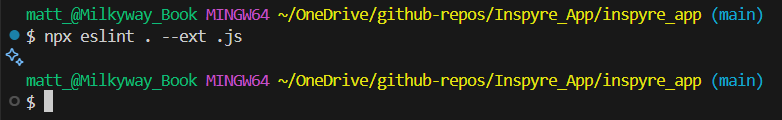

# Testing

This is the TESTING file for the frontend React app, [Inspyre](https://inspyre-53afb73e4a64.herokuapp.com/), a full stack application focused on content creation and sharing.

Return to the [README](./README.md).

View the TESTING file for the backend DRF API [here](#https://github.com/MattMiles95/PP5_Inspyre_Backend/blob/main/TESTING.md).

## Table of Contents

### [Validators](#validators-1)

- [HTML](#html)
- [CSS](#css)
- [JavaScript](#javascript)

### [Lighthouse Testing](#lighthouse-testing-1)

- [Reports](#reports)

### [Manual Testing](#manual-testing-1)

- [Authentication](#authentication)
- [Navbar](#navbar)
- [Homepage](#homepage)
- [Post Creation](#post-creation)
- [Detailed Post View](#detailed-post-view)
- [Post Edit Form](#post-edit-form)
- [Profile Page](#profile-page)
- [Profile Edit Form](#profile-edit-form)
- [Direct Messages](#direct-messages)
- [Refresh Tokens](#refresh-tokens)
- [API Requests](#api-requests)
- [Hooks](#hooks)
- [Components](#components)
- [Browser Compatibility](#browser-compatibility)
- [Device Compatibility](#device-compatibility)

### [Bug Fixes](#bug-fixes-1)

 

## Validators

### HTML

Due to the way React applications render HTML dynamically via JavaScript, traditional HTML validation tools cannot accurately parse the live DOM structure directly from a URL. To ensure accurate validation, I conducted my HTML checks by manually viewing the rendered HTML for each page via Chrome Dev Tools' "Elements" tab, then copying and pasting the rendered HTML into the W3C Nu HTML Checker using its "Direct Input" method.

The below table shows the number of warnings and errors indicated for each page.

| **Page**            | **Errors** | **Warnings** |
| ------------------- | ---------- | ------------ |
| Sign Up             | 0          | 0            |
| Sign In             | 0          | 0            |
| Homepage            | 0          | 0            |
| Pyres               | 0          | 0            |
| Sparks              | 0          | 0            |
| Detailed Post View  | 0          | 0            |
| Post Creation Forms | 0          | 0            |
| Post Edit Forms     | 0          | 0            |
| Profile Page        | 0          | 0            |
| Profile Edit Form   | 0          | 0            |
| Conversation Page   | 0          | 0            |
| Conversations Page  | 0          | 0            |

 

### CSS

Due to Bootstrap causing false warnings, I tested my CSS by direct input into W3C's CSS Validation Service.

| **CSS Module / File** | **Errors** | **Warnings** |
| --------------------- | ---------- | ------------ |
| Asset                 | 0          | 0            |
| Avatar                | 0          | 0            |
| Buttons               | 0          | 0            |
| Comment               | 0          | 0            |
| CommentCreateEditForm | 0          | 0            |
| CommentReplyForm      | 0          | 0            |
| ConversationPage      | 0          | 0            |
| ConversationsPage     | 0          | 0            |
| CustomDropdown        | 0          | 0            |
| CustomErrors          | 0          | 0            |
| Modal                 | 0          | 0            |
| Navbar                | 0          | 0            |
| Post                  | 0          | 0            |
| PostCreateForms       | 0          | 0            |
| PostEditForm          | 0          | 0            |
| PostPage              | 0          | 0            |
| PostsGallery          | 0          | 0            |
| ProfileEditor         | 0          | 0            |
| ProfilePage           | 0          | 0            |
| QuillEditor           | 0          | 0            |
| SignInUpForm          | 0          | 0            |
| UserListModal         | 0          | 0            |
| App                   | 0          | 0            |
| index                 | 0          | 0            |

 

### JavaScript

I implemented ESLint (v.9.x) to validate JavaScript files across the entire codebase ('npx eslint . --ext .js'). This resulted in a nil return, confirming that no errors were detected and my JavaScript code is clean.

 ESLint Terminal Result 

 

 

To eliminate false errors and warnings, the following rule adjustments were made:

- react/react-in-jsx-scope: disabled as React 17+ no longer requires explicit import of React in files using JSX.

- react/prop-types: disabled to avoid unnecessary prop validation warnings. This is appropriate given my focus on internal validation rather than prop type enforcement.

- react/no-unescaped-entities: disabled globally following excessive warnings for JSX content containing apostrophes ('). Each of these warnings were simply a case of an apostrophe being used as common punctuation within a `
`, ``, `
`, etc. and were not genuine syntax errors.

 

## Lighthouse Testing

Using the Lighthouse feature of Google Chrome's Dev Tools, I tested each of Inspyre's webpages for Performance, Accessibility, Best Practices and SEO (Search Engine Optimisation).

| **Page**             | **Performance** | **Accessibility** | **Best Practices** | **SEO** |
| -------------------- | --------------- | ----------------- | ------------------ | ------- |
| Sign Up              | 79              | 93                | 100                | 92      |
| Sign In              | 83              | 93                | 100                | 92      |
| Homepage             | 71              | 100               | 100                | 100     |
| Pyres                | 68              | 95                | 78                 | 100     |
| Sparks               | 67              | 95                | 78                 | 100     |
| Detailed Post View   | 87              | 93                | 100                | 100     |
| Post Creation Forms  | 94              | 95                | 78                 | 100     |
| Post Edit Forms      | 88              | 85                | 74                 | 92      |
| Profile Page         | 99              | 90                | 100                | 90      |
| Profile Edit Form \* | N/A             | N/A               | N/A                | N/A     |
| Conversation Page    | 92              | 95                | 78                 | 100     |
| Conversations Page   | 88              | 88                | 78                 | 100     |

 

Where possible, all testing was conducted in Incognito mode to limit the browser interfering with the results. However, due to the authentication logic I've used (namely the use of auth tokens within CurrentUserContext.js), you can't login to an account while in Incognito mode. This is a known issue with the CurrentUserContext logic taught in the Code Institute 'Moments' walkthrough project (which is likewise effected). As such, features that require authentication (Pyres, Sparks, Post Creation Forms, Post Edit Forms, Profile Edit Form, Conversation List and Conversation Page) were tested in a regular Chrome Browser. As visible from the Lighthouse scores, the use of cookies (specifically, the auth tokens) has led to a significant reduction in **Best Practices** scores.

\* The Profile Edit Form could not be analysed using Lighthouse testing, as running the test kept causing the page to redirect to the homepage. I beleive this is another issue that stems from CurrentUserContext, specifically the useCurrentUser() hook briefly returning 'null' upon page refresh. As the profile edit forms require authorisation, this triggers a redirect to '/'. As this is not an app-breaking bug, I will address it as a fix in 'future features'.

 

## Manual Testing

Extensive manual testing was conducted on each feature of this project to ensure all were functioning as expected. The outcome of this testing and any bug fixes made during the project's development are recorded in the tables below.

 

### Authentication:

#### Account Registration

| **Feature**                                                                           | **Expected Outcome**                                                                                                               | **Result** |
| ------------------------------------------------------------------------------------- | ---------------------------------------------------------------------------------------------------------------------------------- | ---------- |
| Account Registration (success)                                                        | Given the correct details provided, a new User account is created.                                                                 | Pass       |
| Account Registration (no username)                                                    | Given no username is provided, the User is prompted to complete this field                                                         | Pass       |
| Account Registration (duplicated username)                                            | Given a username that already belongs to an account is provided, the User is advised accordingly                                   | Pass       |
| Account Registration (no password)                                                    | Given no password is provided, the User is prompted to complete this field                                                         | Pass       |
| Account Registration (incorrect password - too similar to other personal information) | Given a password that does not meet this specification is provided, the User is advised accordingly                                | Pass       |
| Account Registration (incorrect password - 8 character minimum)                       | Given a password that does not meet this specification is provided, the User is advised accordingly                                | Pass       |
| Account Registration (incorrect password - common password)                           | Given a password that does not meet this specification is provided, the User is advised accordingly                                | Pass       |
| Account Registration (incorrect password - entirely numeric)                          | Given a password that does not meet this specification is provided, the User is advised accordingly                                | Pass       |
| Account Registration (password confirmation error)                                    | Given the password provided in the confrimation box does not match the original password provided, the User is advised accordingly | Pass       |
| Confirmation Modal                                                                    | Given the User successfully creates an account, a confirmation message appears.                                                    | Pass       |

 

#### Login

| **Feature**               | **Expected Outcome**                                                                                                      | **Result** |
| ------------------------- | ------------------------------------------------------------------------------------------------------------------------- | ---------- |
| Login (success)           | Given the correct details provided, the User is signed in.                                                                | Pass       |
| Login (missing details)   | Given the User tries to sign in without providing a username and/or password, they are prompted to complete these fields. | Pass       |
| Login (incorrect details) | Given the User tries to sign in by providing an incorrect username and/or password, they are advised accordingly.         | Pass       |

 

#### Logout

| **Feature** | **Expected Outcome**                                                 | **Result** |
| ----------- | -------------------------------------------------------------------- | ---------- |
| Logout      | Given the User clicks the 'sign out' button, the User is logged out. | Pass       |

 

#### Security

| **Feature**       | **Expected Outcome**                                                                                                                | **Result** |
| ----------------- | ----------------------------------------------------------------------------------------------------------------------------------- | ---------- |
| Authenticated     | Given the User is authenticated, they can freely navigate all pages of the site                                                     | Pass       |
| Not Authenticated | Given the User is not authenticated, they are redirected to the login page should they try to access any of the site's other pages. | Pass       |

 

### Navbar

| **Feature**       | **Expected Outcome**                                                                                                                                          | **Result** |
| ----------------- | ------------------------------------------------------------------------------------------------------------------------------------------------------------- | ---------- |
| Nav Links         | All navigation links contained within the header direct the User to the expected page url.                                                                    | Pass       |
| Authenticated     | Given the User is authenticated, the specific 'authenticated' NavLink items are rendered, and the specific 'not authenticated' NavLink items are removed.     | Pass       |
| Not Authenticated | Given the User is not authenticated, the specific 'not authenticated' NavLink items are rendered, and the specific 'authenticated' NavLink items are removed. | Pass       |
| Avatar            | Given the User is signed in, their profile image is displayed by the 'Avatar' component.                                                                      | Pass       |
| Profile Link      | Given the User is signed in, the 'profile' link directs them to their profile                                                                                 | Pass       |
| Pyres             | Given the User is signed in, the 'pyres' link populates the homepage with only content posted by the users they follow                                        | Pass       |
| Sparks            | Given the User is signed in, the 'sparks' link populates the homepage with only content they have liked                                                       | Pass       |

 

### Homepage

| **Feature**                          | **Expected Outcome**                                                                                                                          | **Result** |
| ------------------------------------ | --------------------------------------------------------------------------------------------------------------------------------------------- | ---------- |
| Posts ordered by recency             | Posts are ordered by newest first, descending to oldest.                                                                                      | Pass       |
| Gallery updating per post submission | Each time new content is posted, the gallery automatically updates (upon refresh) to show the latest posts.                                   | Pass       |
| Infinite Scroll                      | Given more than 10 posts in the gallery, upon scrolling to the bottom of the currently rendered feed, more posts are automatically loaded.    | Pass       |
| Post Links                           | Clicking on a posts directs the User to a detailed view of that post.                                                                         | Pass       |
| Pyres Filter                         | Clicking 'Pyres' filters the homepage gallery to show only posts from creators the User follows.                                              | Pass       |
| Sparks Filter                        | Clicking 'Sparks' filters the homepage gallery to show only posts the User has liked.                                                         | Pass       |
| Searchbar                            | Correctly returns results based on post titles, content, usernames and post tags. Search filters stack with Pyres and Sparks filters.         | Pass       |
| Trending Posts                       | Correctly displays the ten posts with the most likes. Tracks and updates upon page refresh.                                                   | Pass       |
| Mobile layout                        | Given a screen width of ≤600px, the gallery format changes to a single column feed displaying a more complete instance of the Post component. | Pass       |

 

### Post Creation

#### Menu

| **Feature**              | **Expected Outcome**                                                                                                                                 | **Result** |
| ------------------------ | ---------------------------------------------------------------------------------------------------------------------------------------------------- | ---------- |
| Post Creation Menu       | Given the User follows a link to make a post, they are directed to a menu where they must choose if they want to create an image or text based post. | Pass       |
| Post Creation Navigation | The option buttons correctly navigate the User to the expected form (i.e. image or text).                                                            | Pass       |

 

#### Image Form

| **Feature**          | **Expected Outcome**                                                                                                                                                 | **Result** |
| -------------------- | -------------------------------------------------------------------------------------------------------------------------------------------------------------------- | ---------- |
| Back Button          | Given the User clicks the 'back' button, they are navigated back to the post creation menu.                                                                          | Pass       |
| Image Uploading      | Given the User clicks the upload asset, their file explorer window opens and they may select an image file to upload. Only image files are available to be selected. | Pass       |
| File Size Limitation | If the User attempts to upload an file larger than 2MB, the upload will fail and they will be notified of this limitation.                                           | Pass       |
| Input Fields         | All input fields correctly display their labels, placeholder text and work as expected.                                                                              | Pass       |
| Cancel Button        | Cancelling the post will navigate the User back to the window where they first accessed the post creation menu. The post is not saved.                               | Pass       |
| Save Button          | Saving the post will publish it and navigate the User to the detailed view of the post.                                                                              | Pass       |

 

#### Text Form

| **Feature**          | **Expected Outcome**                                                                                                                                                                            | **Result** |
| -------------------- | ----------------------------------------------------------------------------------------------------------------------------------------------------------------------------------------------- | ---------- |
| Back Button          | Given the User clicks the 'back' button, they are navigated back to the post creation menu.                                                                                                     | Pass       |
| Quill Editor         | the User has access to the Quill Editor, with all features therein working as expected. Styles applied in the editor are visible within the editor and the published post (excluding previews). | Pass       |
| File Size Limitation | If the User attempts to upload an file larger than 2MB, the upload will fail and they will be notified of this limitation.                                                                      | Pass       |
| Cancel Button        | Cancelling the post will navigate the User back to the window where they first accessed the post creation menu. The post is not saved.                                                          | Pass       |
| Save Button          | Saving the post will publish it and navigate the User to the detailed view of the post.                                                                                                         | Pass       |

 

### Detailed Post View

| **Feature**                       | **Expected Outcome**                                                                                                                            | **Result** |
| --------------------------------- | ----------------------------------------------------------------------------------------------------------------------------------------------- | ---------- |
| Post Edit & Delete Buttons        | Given the User is the owner of the post, 'delete' and 'edit' buttons appears when accessing the dropdown menu beside the post.                  | Pass       |
| Post Edit                         | Given the User clicks the 'edit' button, they are directed to the post edit form.                                                               | Pass       |
| Post Delete Confirmation Modal    | Giveen the User clicks the 'delete' button, a confirmation modal appears.                                                                       | Pass       |
| Post Delete Success               | Given the User confirms the deletion, the post and any comments are deleted from the database. the User is redirected to their previous window. | Pass       |
| Post Owner Avatar Link            | Given the User clicks on the avatar or username of the post owner, they are directed to that user's profile page.                               | Pass       |
| Post Tags                         | Given the creator added tags to their post, these tag appear beneath the post.                                                                  | Pass       |
| Like Button & Counter             | The 'like' button and counter are displayed with the correct number of likes for that post.                                                     | Pass       |
| Liking a Post                     | Given the User clicks the 'like' button, the icon and counter update accordingly.                                                               | Pass       |
| Unliking a Post                   | Given the User clicks the 'unlike' button, the icon and counter update accordingly.                                                             | Pass       |
| 'Original' Tag                    | Given the creator marked the post as an 'original', an 'original' tag appears beneath the post.                                                 | Pass       |
| Comment Counter                   | The comment counter displays the correct number of comments for that post.                                                                      | Pass       |
| Comment Thread                    | All comments and are displayed within the Comment Thread.                                                                                       | Pass       |
| Comment Thread                    | Given a post has no comments, a message appears in the comment section confirming this fact.                                                    | Pass       |
| Comment Avatar                    | Clicking on the avatar of a user within the comment section will direct the User to the profile associated with that avatar.                    | Pass       |
| Comment Report Button             | Given the User is not the author of a comment, a 'report' button appears when accessing the dropdown menu beside each comment.                  | Pass       |
| Comment Report Confirmation Modal | Given the User clicks the 'report' button, a confirmation modal appears.                                                                        | Pass       |
| Comment Reporting                 | Given the User reports a comment, the comment is replaced with a ‘reported’ message until approved by a moderator or outright deleted.          | Pass       |
| Comment Delete & Edit Buttons     | Given the User is the author of a comment, 'delete' and 'edit' buttons appears when accessing the dropdown menu beside each comment.            | Pass       |
| Comment Delete Confirmation Modal | Given the User clicks the 'delete' button, a confirmation modal appears.                                                                        | Pass       |
| Comment Delete Success            | Given the User confirms the deletion, the comment is deleted from the database. The comment disappears from the Comment Thread.                 | Pass       |
| Comment Edit Process              | Given the User clicks the 'edit' button, they are given the ability to edit the comment in the comment textarea.                                | Pass       |
| Comment Edit Success              | Given the User confirms the edit, the comment is updated.                                                                                       | Pass       |
| Comment Reply Button              | Given the User is not the owner of a comment, that comment will display a 'reply' button beneath it.                                            | Pass       |
| Comment Reply                     | Given the User replies to an existing comment, a visual 'thread' is established. Further replies add to this thread.                            | Pass       |
| Not Authenticated                 | Given the User is not signed in, they are unable to like or comment on the post.                                                                | Pass       |

 

### Post Edit Form

| **Feature**           | **Expected Outcome**                                                                                                                                                                                                                     | **Result** |
| --------------------- | ---------------------------------------------------------------------------------------------------------------------------------------------------------------------------------------------------------------------------------------- | ---------- |
| Pre-populated details | The post edit form is pre-populated with the existing post's details.                                                                                                                                                                    | Pass       |
| Change Image Button   | Given the User is editing an image post, they can upload a new image via the 'change image' button.                                                                                                                                      | Pass       |
| File Size Limitation  | If the User attempts to upload an file larger than 2MB, the upload will fail and they will be notified of this limitation.                                                                                                               | Pass       |
| Quill Editor          | Given the User is editing a text post, they will have access to the Quill Editor, with all features therein working as expected. Styles applied in the editor are visible within the editor and the published post (excluding previews). | Pass       |
| Cancel Button         | Cancelling the edit will navigate the User back to the detailed view of the post and discard any changes made.                                                                                                                           | Pass       |
| Save Button           | Saving the edit will navigate the User back to the detailed view of the post and apply any changes made.                                                                                                                                 | Pass       |

 

### Profile Page

| **Feature**               | **Expected Outcome**                                                                                                                                        | **Result** |
| ------------------------- | ----------------------------------------------------------------------------------------------------------------------------------------------------------- | ---------- |
| User Profile              | Given the User is the owner of the profile, an 'edit' button will display beside their username.                                                            | Pass       |
| Other User Profile        | Given the User is not the owner of the profile, an 'un/follow' and 'message' button will display next to the profile owner's username.                      | Pass       |
| Edit Button               | Given the User clicks the 'edit' button, they are directed to the profile edit form.                                                                        | Pass       |
| Follow Button             | Given the User clicks the 'follow' button, the 'followers' counter will increase by one and the button will update to an 'unfollow' button.                 | Pass       |
| Unfollow Button           | Given the User clicks the 'unfollow' button, the 'followers' counter will decrease by one and the button will update to a 'follow' button.                  | Pass       |
| Message Button            | Given the User clicks the 'message' button, the User is directed to a chat page containing the conversation between the User and the profile owner.         | Pass       |
| Create Conversation       | Given the User clicks the 'message' button but no conversation between the User and the profile owner exists, a new chat is created.                        | Pass       |
| Posts Count               | A count of the number of posts published by the profile owner is displayed below their username.                                                            | Pass       |
| Follower/Following Counts | Counts of the profile owner's 'followers' and 'following' are displayed below their username.                                                               | Pass       |
| Follower/Following Modals | Given the User clicks either of the 'follow' counts, a modal opens containing a list of the relevant users.                                                 | Pass       |
| Profile Tags              | Given the profile owner has selected profile tags, these will appear below their profile stats.                                                             | Pass       |
| Profile Bio               | Given the profile owner has written a bio, this will display within their profile header.                                                                   | Pass       |
| Profile Gallery           | A gallery of only the profile owner's posts will be displayed beneath their profile header. This gallery is functionally identical to the homepage gallery. | Pass       |
| Not Authenticated         | Given the User is not signed in, they are unable to follow or message the profile owner (these buttons are not displayed).                                  | Pass       |

 

### Profile Edit Form

| **Feature**                    | **Expected Outcome**                                                                                                    | **Result** |
| ------------------------------ | ----------------------------------------------------------------------------------------------------------------------- | ---------- |
| Profile Edit Tabs              | The profile edit button renders three tabs: Profile, Username, and Password, each with its respective form component.   | Pass       |
| Profile Form - Display         | The Profile tab renders the profile image, bio, and profile tags, allowing the User to update each.                     | Pass       |
| Profile Form - Save            | Clicking the "Save" button in the submits the form, updating the profile data and navigating back to the previous page. | Pass       |
| Profile Form - Cancel          | Clicking the "Cancel" button discards changes and navigates back to the previous page.                                  | Pass       |
| Profile Form - Error Handling  | Form input errors are displayed below the respective input fields as warning alerts.                                    | Pass       |
| Username Form - Display        | The Username tab displays the current username and allows the User to input a new one.                                  | Pass       |
| Username Form - Save           | Clicking the "Save" button updates the username and displays a confirmation modal.                                      | Pass       |
| Username Form - Error Handling | Form input errors are displayed below the username input as warning alerts.                                             | Pass       |
| Password Form - Display        | The Password tab renders fields for new password and confirmation, allowing the User to update their password.          | Pass       |
| Password Form - Save           | Clicking the "Change Password" button submits the form and displays a confirmation modal.                               | Pass       |
| Password Form - Error Handling | Form input errors are displayed below the respective password fields as warning alerts.                                 | Pass       |
| Navigation Protection          | If the User navigates directly to a form without proper authorization, they are redirected to the homepage.             | Pass       |

 

### Direct Messages

#### Conversations List

| **Feature**                    | **Expected Outcome**                                                                                                                            | **Result** |
| ------------------------------ | ----------------------------------------------------------------------------------------------------------------------------------------------- | ---------- |
| Start New Conversation Button  | Given the User clicks the 'Start New Conversation' button, the search mode is activated, and the search input is displayed.                     | Pass       |
| Back Button                    | Given the User is in search mode, the 'Back' button will exit search mode and return to the conversation list.                                  | Pass       |
| Search Input                   | Given the User types in the search input, the list of users is filtered and displayed in real time based on the query.                          | Pass       |
| Search Results                 | Given a search query, the component will display a list of users matching the search term.                                                      | Pass       |
| User Selection                 | Given the User clicks a search result, they are redirected to the conversation with that user, or a new conversation is created if none exists. | Pass       |
| Spinner During Search          | While the search query is being processed, a loading spinner is displayed in the search results section.                                        | Pass       |
| Conversation List              | Given the User is not in search mode, a list of all their conversations is displayed, showing the username and latest message preview.          | Pass       |
| Empty State - No Conversations | Given the User has no conversations, a message is displayed indicating that no conversations are found.                                         | Pass       |
| Delete Conversation Icon       | Given the User clicks the trash icon next to a conversation, a confirmation modal is displayed.                                                 | Pass       |
| Delete Confirmation Modal      | Given the User confirms the deletion in the modal, the conversation is removed from the list and permanently deleted.                           | Pass       |
| No Messages Preview            | If a conversation has no messages, the conversation list item will display "No messages yet" in the preview section.                            | Pass       |
| Unread Message Indicator       | Given the User has a chat with an unread message, a visual indicator is displayed, notifying them of this.                                      | Pass       |
| Auto-Read Messages             | Given the User opens a chat with an unread message, the message is marked as 'read' and the visual indicator is removed.                        | Pass       |

 

#### Chat

| **Feature**            | **Expected Outcome**                                                                                                     | **Result** |
| ---------------------- | ------------------------------------------------------------------------------------------------------------------------ | ---------- |
| Back Button            | Given the User clicks the 'Back' button, they are navigated back to the ConversationsPage.                               | Pass       |
| User Link              | Given the User clicks the other user's profile link, they are navigated to that user's profile page.                     | Pass       |
| Messages List          | A list of messages in the conversation is displayed in reverse order (most recent at the bottom).                        | Pass       |
| No Messages State      | If there are no messages in the conversation, the message list displays a "No messages yet" state.                       | Pass       |
| Message Bubble Styling | Messages from the current user are styled as sender bubbles, and messages from the other user as receiver bubbles.       | Pass       |
| Auto Scroll            | When a new message is sent or received, the message list automatically scrolls to the most recent message.               | Pass       |
| Message Input          | Given the User types a message in the input field, the content is controlled by the state and updates as the User types. | Pass       |
| Send Message Button    | Given the User clicks the send button, a new message is created and displayed in the message list.                       | Pass       |
| Sending Indicator      | While a message is being sent, the send button displays a loading spinner.                                               | Pass       |

 

### Refresh Tokens

| **Feature**      | **Expected Outcome**                                                                                | **Result** |
| ---------------- | --------------------------------------------------------------------------------------------------- | ---------- |
| Token Refresh    | If the token is close to expiry, it is refreshed using the `/dj-rest-auth/token/refresh/` endpoint. | Pass       |
| Refresh Interval | The token is automatically refreshed every 4 minutes as long as a valid token timestamp exists.     | Pass       |
| Cleanup Interval | When the component unmounts, the interval for automatic token refresh is cleared.                   | Pass       |

 

### API Requests & Error Handling

| **Feature**            | **Expected Outcome**                                                                                                                             | **Result** |
| ---------------------- | ------------------------------------------------------------------------------------------------------------------------------------------------ | ---------- |
| Base URL Configuration | All Axios requests are directed to the base URL `https://inspyre-api-6e178387b3cb.herokuapp.com/`.                                               | Pass       |
| 401 Error Handling     | When a 401 response is received, the User is redirected to the `/401` page and the access token is removed.                                      | Pass       |
| 403 Error Handling     | When a 403 response is received, the User is redirected to the `/403` page.                                                                      | Pass       |
| 404 Error Handling     | When a 404 response is received, the User is redirected to the `/404` page.                                                                      | Pass       |
| 500 Error Handling     | When a 500 response is received, the User is redirected to the `/500` page.                                                                      | Pass       |
| 503 Error Handling     | When a 503 response is received, the User is redirected to the `/503` page.                                                                      | Pass       |
| Response Interceptor   | Handles error responses by redirecting based on status codes (401, 403, 404, 500, 503).                                                          | Pass       |
| Error Page Home Link   | Given the User clicks the 'return home' button on any of the custom error pages, they are directed to the homepage (the given error permitting). | Pass       |

 

### Hooks

#### useClickOutsideToggle

| **Feature**            | **Expected Outcome**                                                                        | **Result** |
| ---------------------- | ------------------------------------------------------------------------------------------- | ---------- |
| 'Click Outside' Toggle | Clicks outside the target area (i.e. dropdown menu) cause the expanded element to collapse. | Pass       |

 

#### useRedirect

| **Feature**         | **Expected Outcome**                                                                                                      | **Result** |
| ------------------- | ------------------------------------------------------------------------------------------------------------------------- | ---------- |
| Logged Out Redirect | If an unauthorised user attempts to access a url that requires authorisation, the User is redirected to the sign in page. | Pass       |
| Logged In Redirect  | If an authorised user attempts to access the sign in or sign up pages, the User is redirected to the homepage.            | Pass       |

 

### Components

#### Custom Dropdown Menu

| **Feature**        | **Expected Outcome**                                                                                                            | **Result** |
| ------------------ | ------------------------------------------------------------------------------------------------------------------------------- | ---------- |
| Toggle Button      | When the User clicks the toggle button, the dropdown menu is displayed.                                                         | Pass       |
| Menu Positioning   | The dropdown menu is positioned relative to the toggle button, adjusting based on its dimensions and screen position.           | Pass       |
| Edit Option        | If the `handleEdit` prop is provided, the "Edit" option is displayed and triggers the `handleEdit` function when clicked.       | Pass       |
| Delete Option      | If the `handleDelete` prop is provided, the "Delete" option is displayed and triggers the `handleDelete` function when clicked. | Pass       |
| Report Option      | If the `handleReport` prop is provided, the "Report" option is displayed and triggers the `handleReport` function when clicked. | Pass       |
| Close After Action | The dropdown menu is closed after any action (Edit, Delete, Report) is executed.                                                | Pass       |
| Z-Index Handling   | The dropdown menu appears above other content layers.                                                                           | Pass       |

 

#### Modal

| **Feature**       | **Expected Outcome**                                                                                           | **Result** |
| ----------------- | -------------------------------------------------------------------------------------------------------------- | ---------- |
| Modal Visibility  | When `isOpen` is `true`, the modal is rendered; when `isOpen` is `false`, the modal is not rendered.           | Pass       |
| Modal Title       | The `title` prop is displayed as the heading within the modal.                                                 | Pass       |
| Modal Content     | The `children` prop is rendered within the modal body.                                                         | Pass       |
| Confirm Button    | If `onConfirm` is provided, a "Confirm" button is rendered and triggers the `onConfirm` function when clicked. | Pass       |
| Cancel Button     | If `showCancel` is `true`, a "Close" button is rendered and triggers the `onClose` function when clicked.      | Pass       |
| Custom Footer     | If `customFooter` is provided, it is rendered in place of the default buttons in the footer section.           | Pass       |
| Overlay Click     | Clicking the overlay does not close the modal; closure is handled via the "Close" button or custom handlers.   | Pass       |
| Z-Index Handling  | The modal overlay is rendered above other content layers.                                                      | Pass       |
| Closing the Modal | The modal is removed from the DOM when `isOpen` is set to `false`.                                             | Pass       |

 

### Browser Compatibility

| Browser         | Expected Outcome                                                        | Result |
| --------------- | ----------------------------------------------------------------------- | ------ |
| Google Chrome   | No issues with appearance, functionality, performance or responsiveness | Pass   |
| Microsoft Edge  | No issues with appearance, functionality, performance or responsiveness | Pass   |
| Mozilla Firefox | No issues with appearance, functionality, performance or responsiveness | Pass   |
| Safari          | No issues with appearance, functionality, performance or responsiveness | Pass   |

 

### Device Compatibility

| Device                                   | Expected Outcome                                                        | Result |
| ---------------------------------------- | ----------------------------------------------------------------------- | ------ |
| Samsung Galaxy S23 Ultra (412px x 750px) | No issues with appearance, functionality, performance or responsiveness | Pass   |
| iPhone 13 (390px x 661px)                | No issues with appearance, functionality, performance or responsiveness | Pass   |
| Apple iPad 8th Gen (580px x 548px)       | No issues with appearance, functionality, performance or responsiveness | Pass   |
| 15.6" Portable Monitor (1280px x 551px)  | No issues with appearance, functionality, performance or responsiveness | Pass   |
| 15.6" Windows Laptop (1536px x 695px)    | No issues with appearance, functionality, performance or responsiveness | Pass   |

(The above viewports were calculated using [whatismyviewport.com](https://whatismyviewport.com/) on each devices' maximised browser window.)

 

## Bug Fixes

Throughout the development of Inspyre's frontend, I carried out the following bug fixes:

| Feature              | Expected Outcome                                                                                              | Actual Outcome                                                                                | Fix                                                                                                                                        |
| -------------------- | ------------------------------------------------------------------------------------------------------------- | --------------------------------------------------------------------------------------------- | ------------------------------------------------------------------------------------------------------------------------------------------ |
| Quill Editor         | When accessing the Quill Editor, all features are usable.                                                     | Bullet styles and alignment formatter not responding (appearing as 'undefined').              | Expressly declare all desired features when configuring Quill Editor.                                                                      |
| Profile Page         | When selecting 'profile' from the navbar menu, the User is directed to their profile page.                    | 404 error.                                                                                    | Fix incorrect route path used in App.js.                                                                                                   |
| Navbar               | No console errors caused by syntax.                                                                           | Error caused by nested `<a>` tags.                                                            | Refactor parent link into a Dropdown.Item.                                                                                                 |
| Heroku Deployment    | App successfully deploys.                                                                                     | Heroku build failure due to incorrect casing of 'useRedirect.js' in git repo.                 | Caused by git not acknowledging file changes that only concern casing. Renamed file, pushed to repo, then renamed again with proper casing |
| Heroku Deployment    | App successfully deploys.                                                                                     | Heroku build failure due to incorrect casing of 'useClickOutsideToggle.js' in git repo.       | Caused by git not acknowledging file changes that only concern casing. Renamed file, pushed to repo, then renamed again with proper casing |
| Direct Messaging     | A User can send a message directly to another User.                                                           | Message post request denied by API.                                                           | Removed `post["Content-Type"] = "multipart/form-data"` as a global rule in axiosDefaults.                                                  |
| Direct Messaging     | Messaging another user for the first time creates a conversation with a waving emoji.                         | Message post request denied by API.                                                           | Updated newMessage post method.                                                                                                            |
| Direct Messaging     | Users are assigned 'sender' or 'receiver' within a conversation, and CSS is applied accordingly.              | Both users assigned as 'receiver'. No distinction in CSS.                                     | Updated logic to correctly assign each participant their respective role.                                                                  |
| Direct Messaging     | When opening a chat, a waving emoji is only sent when a conversation is first created.                        | Everytime a conversation is opened, a waving emoji is sent, regardless of any prior messages. | Updated logic for determining if prior messages have been exchanged.                                                                       |
| Custom Dropdown Menu | Given a user clicks the dropdown menu toggle, the menu appears over the top of any other layer.               | Due to overflow, dropdown menu partially obscured by other layers.                            | Updated Custom Dropdown Menu to use ReactDOM Portal when rendering.                                                                        |
| Modal                | Given a user triggers a modal, the modal appears over the top of any other layer.                             | Due to overflow, modal partially obscured by other layers.                                    | Updated Modal to use ReactDOM Portal when rendering.                                                                                       |
| Replies              | Given a user replies to another user's reply, the comment thread is updated without requiring a page refresh. | Replies to replies not appearing until after page refresh.                                    | Add insertReply handler to CommentReplyForm.                                                                                               |
| Sign Up Link         | Given a user clicks the 'join the community' link on the sign in page, they are directed to the sign up page. | User is redirected to the page they are already on.                                           | Fix incorrect navigate() prop.                                                                                                             |
| Post Deletion        | Upon deleting a post, the User is redirected back to the previous window.                                     | User is redirected to now deleted post, triggering 404 error.                                 | Amend navigate() parameter from (-1) to ('/').                                                                                             |
